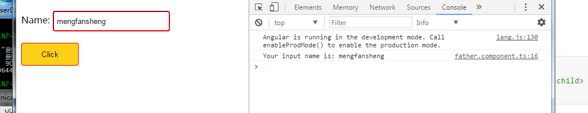

### angular2中父子组件之间的通信

​	一个组件总是拥有多个输入（Input）或者输出属性（Output）。它可以通过组件装饰器或者属性装饰器进行生命。

​	看下面的一个小例子：

​	子组件有一个输入框和一个点击按钮，输入框的placeholder属性由使用它的父组件来确定。子组件的按钮负责将输入框中的内容发送到外界

child.component.html：

```html
<div>
  <form action="" #formRef="ngForm" (ngSubmit)="doLogin(formRef.value)">
    Name:
      <input type="text" 
             [placeholder] = 'placeholder' 
             [(ngModel)] ='userName' 
             name="userName">
    <div>
      <button type="button" (click)="emitEvent()">Click</button>
    </div>
  </form>
</div>
```

child.component.ts：

```typescript
import {Component, OnInit, Input, Output, EventEmitter} from '@angular/core';

@Component({
  selector: 'app-child',
  templateUrl: './child.component.html',
  styleUrls: ['./child.component.css']
})
export class ChildComponent implements OnInit {
  userName: string = '';

  @Input() placeholder: string= 'Input your name';
  @Output() verficate = new EventEmitter<string>();
  constructor() { }

  ngOnInit() {}

  emitEvent() {
    this.verficate.emit(this.userName)
  }

  doLogin(value) {
    console.log(value);
  }
}
```

​	通过@Input来表示输入型的属性，@Output则表示这个属性向外传送数据。`@Input() placeholder： string='Input your name'`表示使用子组件时通过`placeholder`这个属性向子组件传递数据，这样输入框的站位文字可以在使用的时候由父组件来指定，如果父组件不指定则使用默认值。`@Output() verficate = new EventEmitter<object>()`表示子组件通过`verficate`这个__事件__向外界传递属性，父组件可以自定义响应事件的方法。


father.component.html：

```html
<div>
  <app-child placeholder="Input your name" (verficate)="onVerficate($event)" ></app-child>
</div>
```

​	父组件在使用子组件的时候，通过子组件的`placeholder`属性向子组件内部传递了数据`placeholder='Input your name'`；`(verficate)="onVerficate($event)"`表示子组件的输出数据通过父组件内部的`onVerficate()`方法处理，所以需要在父组件内部定义`onVerficate()`方法。

father.component.ts：

```typescript
import { Component, OnInit } from '@angular/core';

@Component({
  selector: 'app-father',
  templateUrl: './father.component.html',
  styleUrls: ['./father.component.css']
})
export class FatherComponent implements OnInit {

  constructor() { }

  ngOnInit() {
  }
  onVerficate(value) {
    console.log("Your name is: " + value);
  }
}
```

​	`onverficate()`方法中拿到子组件传出来的数据后直接在控制台输出。

