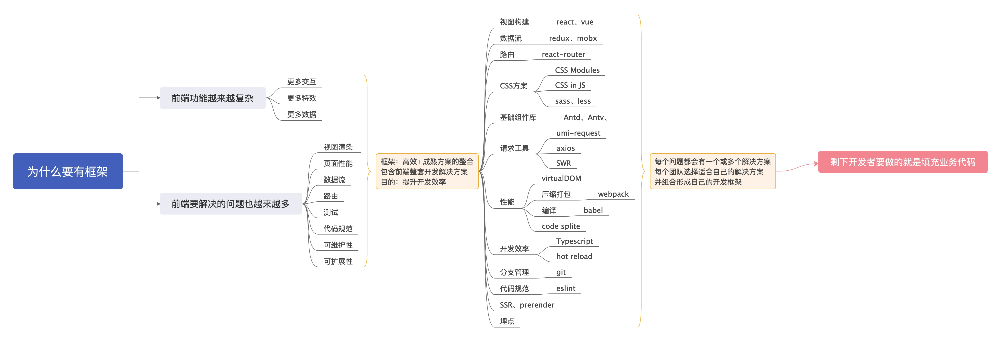

## 为什么要有框架

### 原因：

1. 前端功能越来越复杂
   * 更多交互
   * 更多特效
   * 更多数据
2. 前端要解决的问题也越来越多
   * 视图渲染
   * 页面性能
   * 数据流
   * 路由
   * 测试
   * 代码规范
   * 可维护性
   * 可扩展性

### 什么是框架

**框架是一整套高效+成熟方案的整合，包含前端开发整个链路各个节点的解决方案**。框架出现的目的是**为约束和简化业务开发提供有用的指导**。

## 一个框架包含哪些内容

1. 视图构建：react、vue
2. 数据流：redux、mobx
3. 路由：react-router
4. CSS方案：sass、less、CSS in JS、CSS Modules
5. 基础组件库：Antd、Antv
6. 请求工具：umi-request、axios、SWR
7. 性能：VirtualDOM、code splite
8. 基础工具：打包压缩webpack、编译babel
9. 开发效率：Typescript、hot reload
10. 分支管理：git
11. 代码规范：eslint
12. SSR、prerender
13. 页面埋点

上面的每个点都可以展开详细的说，所以，加油吧。

（图是自己画的。。。）

参考：

[if 我是前端Leader，谈谈前端框架体系建设](https://juejin.im/post/5decf88f51882512327a510a#heading-7)

[蚂蚁前端研发最佳实践](https://github.com/berwin/Blog/issues/20)

[聊聊我对现代前端框架的认知](https://zhuanlan.zhihu.com/p/94949118)