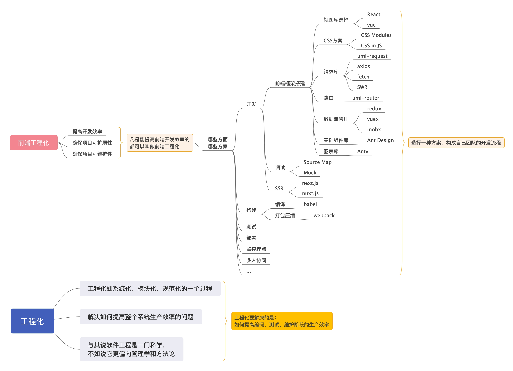

## 前端工程化

开局一张图。。。

### 概念

将软件工程的方法和原理运用在前端开发中，目的是实现__高效开发，有效协同，质量可控__。

前端工程化目的：**提升业务效率**

狭义的讲，前端工程化是指将开发阶段的代码转变成生产环境的代码的一系列步骤。主要包括__构建，分支管理，自动化测试，部署__等。

广义的讲，我理解还应该包括开发阶段，其中又包括开发框架搭建，基础工具（请求库、路由库等）选型，视图基础组件库选择等基础工具的选择，这些都确定了之后，剩下的就是编写业务代码。总体来讲，前端开发框架的搭建以及业务代码的编写也是工程化的一部分，也就是说，广义上的前端工程化包括了从开发框架搭建、到业务开发、到测试，再到线上部署的整个链路过程。

### 为什么？

为什么要把前端**工程“化”**？以前没有工程“化”么？工程“化”意味着什么？

早期的前端页面由JSP、PHP等在服务端生成，浏览器只负责展现，这个时候前端开发重度依赖开发环境，前后端职责纠缠不清（甚至没有前端概念），可维护性差。

Ajax出现后，前端进入SPA（Single Page Application）时代，前后端开始分离，前端职责越来越清晰。

随着前端页面复杂性增加（功能、特效、数据等），前端出现了各种框架或者说工具库来满足快速构建前端应用需求，例如Backbone、AngularJS、React、Vue等，此时进入前端为主的MVC、MV*时代。

随着应用复杂性提高，应用对前端的要求也随之提高：开发、构建、渲染、维护性、扩展性等各方面都对前端提出了很高的要求。而随着Node.js兴起，各种用nodejs编写的前端工具如雨后春笋冒出来，前端面临的很多问题也都有了解决方案。

React、Vue等工具聚焦于解决视图快速构建的问题，webpack聚焦于解决前端应用打包构建的问题，前端框架是包含前端开发各个链路在内的一整套前端开发解决方案，**前端工程**说的是从开发到部署线上再到后期迭代这一整个过程，而**前端工程化**说的则是从工程的角度管理前端开发，形成前端开发流程的一整套开发规范，提高前端开发效率。

所以，为什么前端要工程化？**为了提高前端开发效率，提高前端应用的可扩展性、可维护性等性能。**

### 前端工程化的内容

* 规范：代码规范、目录结构规范、前后端接口规范、文档规范、commit规范、流程规范等

* 分支管理：不同的开发人员开发不同的功能或组件，按照统一的流程合并到主干
* 组件化开发：这个是最基本的吧
* 模块管理：一方面，团队引用的模块应该是规范；另一方面，必须保证这些模块可以正确的加入到最终编译好的包文件中
* 前端技术或框架规范：
  * CSS方案：CSS Modules，CSS in JS
  * 视图方案：react、Vue
  * 数据管理方案：redux、mobx
  * 路由：react-router
  * 请求库：fetch、axios、SWR、umi-request
  * ...
* 自动化测试：为了保证和并进主干的代码达到质量标准，必须有测试，而且测试应该是自动化的，可以回归的。
* 构建：主干更新后，自动将代码编译为最终的目标格式，并且准备好各种静态资源
  * webpack
  * Babel
* 部署：将构建好的代码部署到生产环境
* 版本管理，发布方式（纯前端发布）
* ...

一个人开发时，使用一些工具来提升自己的效率——工程化最初阶段（工具化）

多人协同开发时，大家需要约定一些规范，所有人都需要遵守规范——规范化

当协同规模再大一点时（几十人），规范的落地变得有难度，通过一个流程的方式来保障———流程化

当协同人员数量到几百甚至上千的时候，就会形成一个一个小技术圈子，开始出现能力的重复建设和内耗，这个时候就需要对日常研发过程中的所需能力进行分层，抽象出来的基础能力通过某个平台来承载，其他业务或团队基于抽象出来的能力进行二次开发——中台化

总的来讲，**一个完整的前端工程体系应该包括**：

1.统一的开发规范

2.组件化开发

3.构建流程

开发规范和组件化开发面向开发阶段，宗旨是提高团队协作能力，提高开发效率并降低维护成本

构建工具和平台解决了web产品一些列的工程问题，旨在提高web产品的性能表现，提高开发效率。

参考：

[前端工程化](https://www.cnblogs.com/ihardcoder/p/5378290.html)

[从淘宝前端工程化演进，看工程化之路如何“私人订制”](https://www.infoq.cn/article/Kpd_C06scWePcO8fB7ex)

[我对前端工程化的理解](https://juejin.im/post/58ac334e8d6d810058c103e0)

[前端工程化概述](https://juejin.im/post/5ac9c6f451882555677ed301)

