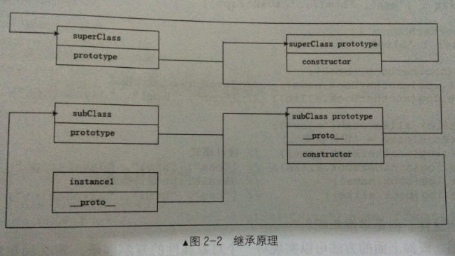

### 寄生组合式继承

构造函数继承+寄生式继承的组合。

代码实现： 

```javascript
//原型式继承
function inheritObject (o){
  	//过渡对象
  	function F(){};
  	//过渡对象的原型继承父对象
  	F.prototype = o;
  	//返回一个过渡对象的实例，该实例的原型继承了父对象
  	return new F();
}

function inheritPrototype(subClass, superClass){
  	//复制一份父类的原型副本保存在变量中
  	var p = inheritObject(superClass.prototype);
  	//修正因为重写子类原型导致子类的constructor属性被修改
  	p.constructor = subClass;
  	//设置子类的原型
  	subClass.prototype = p; 	
}
```

上面的代码是通过原型式继承得到了父类原型对象的一个副本。直接将父类原型赋值给子类原型是有问题的，因为父类原型对象复制得到的复制对象`p`中的`constructor`指向的不是`subClass`对象，而是`Object()`，所在寄生式继承中要对复制对象`p`做一次增强，修复其`constructor`属性指向不正确的问题，最后将得到的复制对象`p`赋值给子类原型，这样子类的原型就继承了父类的原型并且没有执行父类的构造函数。

真正的寄生组合式继承还要搭配构造函数继承。

测试用例：

```javascript
//定义父类
function SuperClass(name){
  	this.name = name;
  	this.colors = ["red", "blue", "green"];
}
//定义父类原型方法
SuperClass.prototype.getName = function(){
  	console.log(this.name);
}
//定义子类
function SubClass(name, time){
  	//构造函数式继承
  	SuperClass.call(this, name);
  	//子类新增属性
  	this.time = time;
}
//寄生式继承父类原型
inheritObject(SubClass, SuperClass);
//子类新增原型方法
SubClass.prototype.getTime = function(){
  	console.log(this.time);
}

var instance1 = new SubClass("js book", 2014);
var instance2 = new SubClass("css book", 2013);

instance1.colors.push("black");
console.log(instance1.colors);//["red", "blue", "green", "black"];
console.log(instance2.colors);//["red", "blue", "green"];
instance2.getName();//css book
instance2.getTime();//2013
```

继承原理如下图：



这其中最大的改变就是对子类原型的处理，被赋予父类原型的一个引用，这是一个对象，因此这里有一点要注意，就是子类在想添加原型方法必须通过`prototype`.对象，通过点语法一个一个添加，否则直接赋予对象就会覆盖掉从父类原型继承的对象了。

