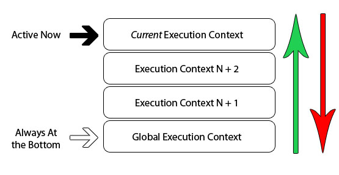

### JS的执行上下文和执行堆栈

##### 什么是执行上下文

js中代码执行所处的环境大致可以分为以下三种：

 * 全局环境
 * 函数运行产生的环境
 * eval运行产生的环境

我们把代码执行时所处的环境叫做__执行上下文__。下面的示例中包含了全局上下文和函数（或者说局部）上下文。


上面图片中，紫色框起来的是全局上下文，绿色/蓝色和橙色框起来的是函数上下文。全局上下文只有一个，随时可以在其他上下文中获取到全局上下文。

函数上下文可以有多个，每个函数在运行时也都会创建一个新的上下文，这个上下文会新建一个私有作用域，在这个作用域内声明的变量及函数外部作用域无法获取。上面的图片中，每个函数内部都可以获取其所处上下文中的变量，但从外部上下文中却不能获取到内部上下文中声明的变量或者函数。

##### 执行堆栈

js的解释器是单线程的，也就是说同一时间只能有一个任务被执行，其他动作或者时间需要在一个叫做__执行堆栈__的地方排队等地。下面是一个单线程堆栈示意图：



当浏览器初次加载脚本时，全局上下文就会被推入到执行堆栈中。如果在全局上下文中执行函数，那么代码的执行就会进入到函数中去并创建一个执行上下文，而且这个执行上下文会被推入到栈顶。

如果你在当前这个函数内部又执行了另外一个函数，那么相同的事情还会发生一次（创建上下问，推入执行堆栈）。浏览器总是会执行处于栈顶的执行上下文。当当前上下文中的代码运行完毕后，该上下文就会退栈，执行控制权就会回到下一层执行上下文中。下面一个示例展示了一个递归函数运行时的执行堆栈

```javascript
(function foo(i){
    if(i === 3){
        return;
    } else {
        foo(++i)
    }
}(0))
```

