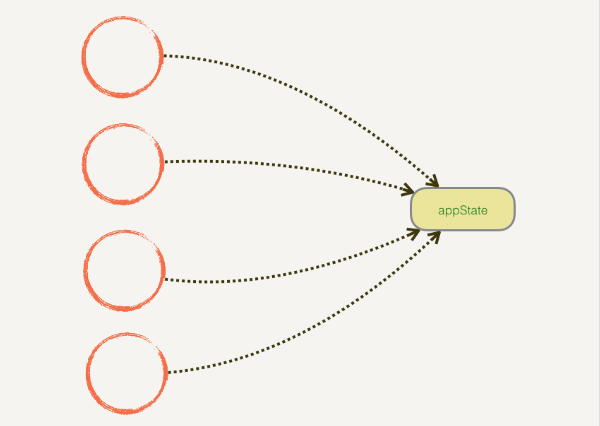
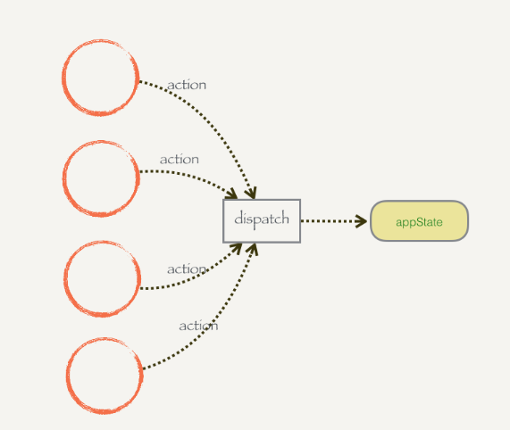

Redux是一种架构模式

React-redux是把redux这种架构模式和React.js结合结合起来的一个库。

当前一个web应用的数据来源十分丰富，服务器响应、页面事件、缓存数据、路由变化等。数据发生变化后往往UI也要发生对应的变化；而且同一个数据可能被多个地方共享，其中一处修改了这个数据后，其他地方也需要更新显示。另外，因为数据是共享的了，所以数据就不能被随便修改，否则很容易导致bug，或者出了bug很难定位。

基于上面的问题：

* 数据来源越来越丰富，需要一个统一个管理工具
* 共享数据不能被随便修改，需要有个统一的方法或者工具来管理共享数据的修改。

Redux将所有数据统一到一个store（只是个名字）里管理，想要修改数据也必须通过dispatch来完成。

下面看例子。

需求是我们需要在页面上渲染书籍的名字和内容，对应的数据结构如下：

```javascript
let appState = {
    title:{
        text:'什么是redux',
        color:'red'
    },
    content:{
        text:'redux是一种状态管理工具',
        color:'blue'
    }
}
```

我们把上面的数据直接以props的形式传入到组件内部供组件渲染

```jsx
// index.js
ReactDOM.render(<App book={appState} />, document.getElementById('root'));

// App.js
class App extends React.Component{
    render(){
        return (
            <div>
                <div id = 'title'>{this.props.book.title.text}</div>
           		<div id = 'content'>{this.props.book.content.text}</div>
             </div>
        )
    }
}
```

现在代码的其他地方要对这个数据进行修改，因为数据发生了修改，为了能让页面展示正常的数据，我们需要重新执行一次`ReactDOM.render()`方法来把数据更新到页面上。

```jsx
let appState.title.text = 'what is redux?'; // 数据修改
ReactDOM.render(<App book={appState} />, document.getElementById('root')); // 重新渲染
```

现实中是有这样一个场景的，这个`appState`在页面其他多个地方还被使用着，也就是说这个`appState`是个共享数据，而且这些地方都有可能对`appState`进行修改。由于每个数据的使用者都可能对数据进行修改，导致了数据是无法预测的，出现问题定位起来就会非常苦难。

所以，虽然组件或者说模块之间可以共享数据，但是不能让共享数据随随便便就被修改。我们来提高一下数据修改的门槛：只能对共享数据进行已经定义过的修改，而且这个修改只能通过固定的方法来触发。

我们把这个方法叫做`dispatch`，把要对数据进行的修改用`action`来表示，可对数据进行的修改我们先定义在`dispatch()`方法内部：

```javascript
function dispatch(action){
    switch (action.type){
        case 'UPDATE_TITLE_TEXT':
          appState.title.text = action.text
          break
        case 'UPDATE_TITLE_COLOR':
          appState.title.color = action.color
          break
        default:
          break
    }
}
```

__所有对数据的修改都必须通过`dispatch()`方法完成，而且修改必须事先定义好__。`dispatch()`接收一个参数`action`，这个`action`是一个对象，里面包含了一个`type`属性来表示到底要对数据做什么样的修改，有了这个`type`之后，`diaptch`会拿这个`type`去匹配已经定义的修改，匹配到了就做相应的修改。`action`中还可以携带其他字段，这个就可以自定义了。

下面来通过`dispatch()`来对数据进行修改。

```jsx
// index.js
dispatch({type:'UPDATE_TITLE_TEXT', text:'what is redux'}); // 发起修改
ReactDOM.render(<App book={appState} />, document.getElementById('root'));// 重新渲染
dispatch({ type: 'UPDATE_TITLE_COLOR', color: 'blue' }); // 发起修改
ReactDOM.render(<App book={appState} />, document.getElementById('root'));// 重新渲染
```

现在，我们不必担心共享数据的其他消费者会对共享数据做什么修改。因为所有的修改都必须通过`dispatch()`来完成，当有问题出现时，我们可以在`dispatch()`中拦截到修改。

没有`dispatch()`之前共享数据是这么修改的：



使用`dispatch()`之后共享数据的修改变成这样：



