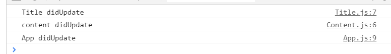
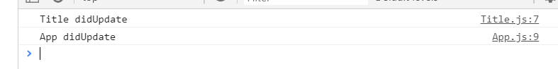

优化，减少re-render次数

纯函数：每次修改都返回一个新对象

为了模拟真实情况，我们来将App组件拆分成两个组件：

```jsx
class Title extends Component{
    render(){
        return (
        	<div id='title'>{this.props.title.text}</div>
        )
    }
}

class Content extends Component{
    render(){
        return (
        	<div id='content'>{this.props.content.text}</div>
        )
    }
}

class App extends Component{
    render(){
        return (
        	<div>
        		<Title title={this.props.book.title} />
        		<Content content={this.props.book.content}>
        	</div>
        )
    }
}
```

现在组件`App`内包含两个组件：`Title`和`Content`。我们在每个组件的`componentDidUpdate()`方法中都打上日志，看下有数据改变时组件的更新情况：

```jsx
class Title extends Component{
    //...
    componentDidUpdate(){
        console.log('Title didUpdate')
    }
    //...
}
class Content extends Component{
    //..
    componentDidUpdate(){
        console.log('Content didUpdate');
    }
    //..
}
class App extends Component{
    //..
    componentDidUpdate(){
        console.log('App didUpdate')
    }
}

//index.js
store.dispatch({type:'UPDATE_TITLE_TEXT', text:'what is redux'}); // 发起修改

```

一次数据更改后，控制台输出如下：



我们修改的数据是title，按理说应该只重新渲染`Title`组件才合适，`Content`组件没必要重新渲染，但实际情况是`Content`组件也进行了re-render。下面我们在组件中通过`shouldComponentUpdate()`来优化一下：

```jsx
class Title extends Component{
    //...
    componentDidUpdate(){
        console.log('Title didUpdate')
    }
    shouldComponentUpdate(nextProps){
        if(this.props.title !== nextProps.title){
            return true;
        }
        return false;
    }
    //...
}
class Content extends Component{
    //..
    componentDidUpdate(){
        console.log('Content didUpdate');
    }
    shouldComponentUpdate(nextProps){
        if(this.props.content !== nextProps.content){
            return true;
        }
        return false;
    }
    //..
}
class App extends Component{
    //..
    componentDidUpdate(){
        console.log('App didUpdate')
    }
    shouldComponentUpdate(nextProps){
        if(this.props.book !== nextProps.book){
            return true;
        }
        return false;
    }
}
```

这时候刷新页面，发现数据变更后页面没有随之重新渲染，问题何在？

我们在`shouldComponentUpdate`中比较了组件props中指定属性的变化，有变化则重新渲染，否则不进行重新渲染。但是，我们注意到，`this.props.book`、`this.props.title`以及`this.props.content`都是一个复杂变量，变量内部保存的是一个指针，修改对象的属性的话这些指针是不会有变化的。看一下`stateChanger`中是如何修改数据的：

```javascript
function stateChanger(action){
    switch (action.type){
        case 'UPDATE_TITLE_TEXT':
          // 直接修改原对象属性，保存对象指针的变量的不会有变化
          appState.title.text = action.text;
          break
        case 'UPDATE_TITLE_COLOR':
          // 直接修改原对象属性，保存对象指针的变量的不会有变化
          appState.title.color = action.color;
          break
        default:
          break
    }
}
```

`stateChanger`中对数据的修改都是直接修改原对象属性。这种情况下，虽然属性发生了变化，但是对象指针是不变的，所以此时在`shouldComponentUpdate`中直接比较对象是没法达到预期效果的。那怎么办？

可不可以依次比较对象下的可能发生变化的属性呢：

```jsx
class Title extends Component{
    //..
    shouldComponentUpdate(nextProps){
        if(this.props.title.text !== nextProps.title.text || 
           this.props.title.color !== nextProps.title.color){
            return true
        }
        return false;
    }
}
```

这样的写法能达到效果。但是假如`title`下有很多个属性，每个属性修改都需要重新渲染，这种情况下难道每个属性都要在`shouldComponentUpdate`中比较一遍么？

```javascript
class Title extends Component{
    //...
    componentDidUpdate(){
        console.log('Title didUpdate')
    }
    shouldComponentUpdate(nextProps){
        if(this.props.title.text !== nextProps.title.text || 
        this.props.title.color !== nextProps.title.color || 
        this.props.title.xxx !== nextProps.title.xxx){
            return true;
        }
        return false;
    }
    //...
}
```

这种写法显然是不恰当的。还有种方法是对`this.props.title`和`nextProps.title`进行深比较，理论上是可行的，但是对象之间的深比较是比较耗性能的，尤其是对象结构比较复杂的情况下。

最好属性修改时外层对象也能有所改变----修改属性时，将属性路径上的对象都复制一遍，属性的修改最终在外层对象层面上能有所察觉----这样我们使用浅比较就可以知道对象是否有变化。

修改下`stateChanger()`：

```javascript
function stateChanger(action){
    switch (action.type){
        case 'UPDATE_TITLE_TEXT':
          return {...appState, title:{...title, text:action.text}}
          break
        case 'UPDATE_TITLE_COLOR':
          return {...appState, title:{...title, color: action.color}}
          break
        default:
          return appState;
    }
}
```

然后再修改下`createStore`：

```javascript
function createStore(state, stateChanger){
    const listeners = [];
    const subscribe = listener => listeners.push(listener);
    const getState = ()=> state;
    const dispatch = (action) => {
        state = stateChanger(action);
        listeners.forEach(listener => listener());
    }
    return {getState, dispatch, subscribe}
}
```

刷新下页面，发现页面能正常反应出数据变化，而且这次也只有`Title`组件重新渲染了，`Content`组件没有重新渲染。



一句话总结就是__每次修改都要返回一个新的对象__。

来解决个bug，上面的代码每次只能基于初始状态值修改（每次基于`appState`进行修改，而不是上一次修改后的状态值），这显然是不行的。例如，进行下面三次修改：

```javascript
store.dispatch({type:'UPDATE_TITLE_TEXT', text:'what is redux'}); // 发起修改
store.dispatch({type:'UPDATE_TITLE_COLOR', color: 'blue'}); // 发起修改
store.dispatch({type:'UPDATE_TITLE_TEXT', text:'WHAT IS REDUX'}); // 发起修改
```

这样的三次修改后，理论上最后的字体颜色应该是blue才对，但实际还是原来的red色。原因就是我们每次的修改是基于最原始的`appState`，而不是上一次修改后的状态值。

现在来解决下这个问题。我们把`appState`作为入参传入到`stateChanger`中，并且每次修改都传入最新的状态值。

```javascript
function stateChanger(state, action){
    switch (action.type){
        case 'UPDATE_TITLE_TEXT':
          return {...state, title:{...state.title, text: action.text}};
        case 'UPDATE_TITLE_COLOR':
          return {...state, title:{...state.title, color: action.color}}
        default:
          return state;
    }
}

function createStore(state, stateChanger){
    const listeners = [];
    const subscribe = (listener) => listeners.push(listener);
    const getState = () => state;
    const dispatch = (action) => {
        state = stateChanger(state, action);
        listeners.forEach(listener => listener());
    }
    return (getState, dispatch, subscribe);
}
```

经过上面的修改后，最后字体的颜色是blue，而且文字内容显示的也都正确。

我们把`stateChanger()`这一类型的方法统称为reducer。reducer负责接收action，并决定对state进行什么样的修改，每次修改都会返回一个新的对象。

可不可以在reducer中添加一些副作用，比如发起网络请求，基于传入的参数修改DOM等等？为了保证reducer结果的可以预测，我们不在reducer进行有副作用的操作。

说到最后，reducer其实是纯函数，其最终的修改结果只与入参有关，并且不产生任何副作用。