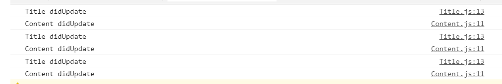

组件各自按需订阅store


```javascript
// createStore
function createStore(state, reducer){
    const listeners = [];
    const subscribe = (listener) => listeners.push(listener);
    const getState = ()=> state;
    const dispatch = (action) => {
        state = reducer(state, action);
        listeners.forEach(listener => listener());
    };
    return {getState, dispatch, subscribe}
}

//index.js

```

上面是`createStore()`方法。在使用的时候，我们是将`store`作为最外层的组件`App`的props传入进去，然后由`App`将数据再以props的形式按需传给其他组件，当组件想要从store中获取数据时必须由父组件传给它。这样做有点麻烦，而且在数据一层层的传递过程中很容易产生问题，产生问题后又很难定位。此外，我们在使用时是将`ReactDOM.render()`方法订阅到了store上，有数据变化时整个组件树都会re-render，为了避免性能问题，还要在每个组件中重写`shouldComponentUpdate()`方法，这样做也是比较麻烦的，一个应用中组件有很多，每个组件都写`shouldComponentUpdate()`方法真的很烦，而且，有的组件可能根本就不需要从store中获取数据，再因为store发生变化专门写个`shouldComponentUpdate`显得有点啰嗦了。

有没有一种方法，可以让组件各自按需去订阅store？这样store发生变化时就只会更新那些订阅store的组件而不是整棵组件树。

我们以这个为目标，试着实现以下。

上面说过，数据一层层传递容易出现问题，那有没有一种方法，使得store可以做到类似于全局变量的地位，处于这个作用域下的组件都可以获取到store？

这就需要使用React中的`context`API了。中文翻译过来是"上下文"，使用`context`可以跨层级传递数据，而不必再逐层传递。


```jsx
//将store的创建分离到store.js中
import React from 'react';

const appState = {
    title:{
        text:'什么是redux',
        color:'red'
    },
    content:{
        text:'redux是一种状态管理工具',
        color:'blue'
    }
}

function stateChanger(state,action){
    switch (action.type){
        case 'UPDATE_TITLE_TEXT':
          return {...state, title:{...state.title, text: action.text}};
        case 'UPDATE_TITLE_COLOR':
          return {...state, title:{...state.title, color: action.color}}
        default:
          return state;
    }
}

function createStore(state, stateChanger){
    const listeners = [];
    const subscribe = listener => listeners.push(listener);
    const getState = () => state;
    const dispatch = (action) => {
        state = stateChanger(state, action)
        listeners.forEach(listener => listener());
        
    };
    return {getState, dispatch, subscribe};
}

const store = createStore(appState, stateChanger)

const storeContext = React.createContext({ // 创建上下文
    store: store
})

export {store, storeContext};


//Title.js
import {storeContext} from './store.js';

class Title extends Component{
    componentDidUpdate(){
        console.log('Title didUpdate');
    }
    componentDidMount(){
        this.props.store.subscribe(() => {
            this.setState({}); // 订阅store，数据有变化时，发起re-render
        })
    }
    
    render(){
        return (
        	<div id='title' style={{color: this.props.title.color}}>
                {this.props.store.title.text}
            </div>
        )
    }
}
Title.contextType = storeContext; // 上下文

// Content.js做同样的修改
import {storeContext} from './store.js';

class Content extends Component{
    componentDidUpdate(){
        console.log('Content didUpdate');
    }
    componentDidMount(){
        this.context.store.subscribe(() => { //  从上下文获取store
            this.setState({}); // 订阅store，数据有变化时，发起re-render
        })
    }
    render(){
        return (
        	<div id='content'>
              {this.context.store.getState().content.text}
          	</div>
        )
    }
}
Content.contextType = storeContext;
export default Content;

// App.js经过改动后则变得更简单
class App extends Component {
    componentDidUpdate(){
        console.log('App didUpdate');
    }
    render(){
        return (
            <div>
        		<Title />
        		<Content />
        	</div>
        )
    }
}

export default App;

//index.js
import React from 'react';
import ReactDOM from 'react-dom';
import './index.css';
import App from './App';
import * as serviceWorker from './serviceWorker';
import {store} from './store';

ReactDOM.render(<App />, document.getElementById('root'));

store.dispatch({type:'UPDATE_TITLE_TEXT', text:'what is redux'}); // 发起修改
store.dispatch({type:'UPDATE_TITLE_COLOR', color: 'blue'}); // 发起修改
store.dispatch({type:'UPDATE_TITLE_TEXT', text:'what is reaadux'}); // 发起修改

serviceWorker.unregister();
```

现在实现了组件各自按需订阅store，避免了数据层层传递带来的风险。现在来优化下上面的代码。通过`componentDidUpdate()`打印输出的日志发现，每次数据变更，订阅到store上的组件都会re-render，无论组件自身渲染的数据改变与否。

```javascript
//发起三次变更
store.dispatch({type:'UPDATE_TITLE_TEXT', text:'what is redux'}); // 发起修改
store.dispatch({type:'UPDATE_TITLE_COLOR', color: 'blue'}); // 发起修改
store.dispatch({type:'UPDATE_TITLE_TEXT', text:'what is reaadux'}); // 发起修改
```

控制台输出如下：




