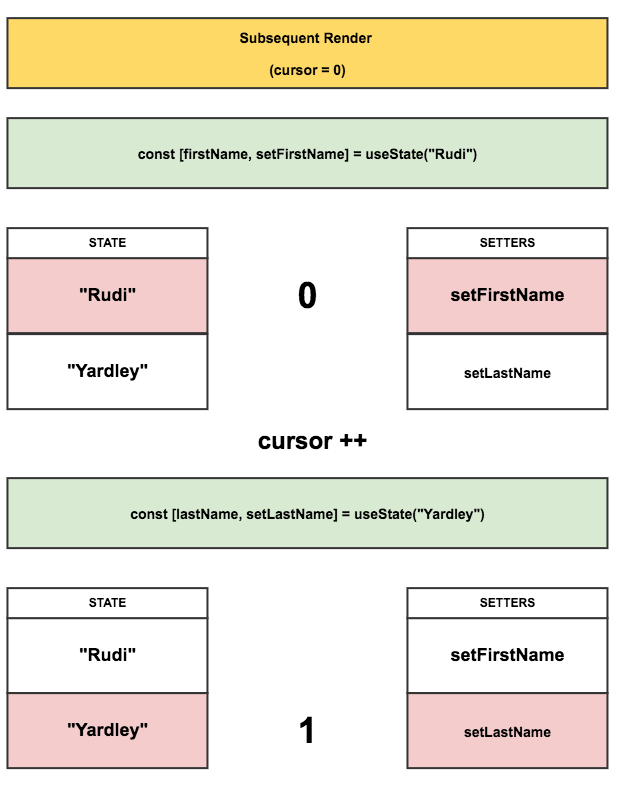

#### React hooks: not magic, just arrays

翻译自https://medium.com/@ryardley/react-hooks-not-magic-just-arrays-cd4f1857236e


##### hooks的工作方式

__hooks使用规则__

使用hooks需要遵守以下两条规则：

* 不能在循环、条件语句和嵌套函数中使用hooks
* 只能在函数组件中使用hooks

第二条不用多说，想让函数组件具有类组件的某种行为就要把这种行为与组件联系起来。

第一条规则有些让人不明白，对于一个API来说，居然不能在循环、条件语句以及嵌套函数中使用，这很让人费解。接下来我就来解释一下。


__我们可以将hooks的实现简单理解为数组。__


##### How could we implement  'useState()'

看下面的组件：

```jsx
function RenderFunctionComponent(){
	const [firstName, setFirstName] = useState('Rudi');
	const [lastName, setLastName] = useState('Yardlery');
	
	return (
		<Button onClick={() => setFirstName('Fred')}>Fred</Button>
	)
}
```

hooks会返回一个数组，数组的第二个元素为setter函数，通过这个setter函数可以控制当前hook生成的变量（对应返回的数组中的第一个元素）。

##### So what's React going to do with this?

下面的是组件渲染时的示意图----组件的渲染处在一个指定的上下文中，该上下文中存储着组件渲染需要的数据，而且这些数据都处在组件外部，并且都能被指定组件所获取。

1.Initialisation

创建两个空的数组：`setters`和`state`

将数组索引的指针设置到 0 位置


2.First render

运行组件函数

开始运行后，代码中每次对`useState()`的调用都会往`setters`数组中当前指针指向的位置填入一个setter方法，同样的，`state`数组中相同位置也会被添加一些状态值。


3.Subsequent render

每次渲染时，相应的值和方法都会从数组中读出，本次渲染结束后数组指针都会被重置为 0 然后等待下次渲染。 



4.Event handling

每个setter方法都保存着自己的指针位置。当调用某个setter方法时，该setter方法会修改处于同样索引位置的`state`数组中的那个值（`setter`和`state`都是成对的，并且在两个数组中都处于相同位置）


##### And the naive implementation

下面是伪代码实现（这只是伪代码！！）：

```jsx
let state = [];
let setters = [];
let firstRun = true;
let cursor = 0;

function createSetter(cursor){
    return function setterWithCursor(newVal){
        state[cursor] = newVal;
    }
}

export function useState(initVal){
    if(firstRun){
        state.push(initVal);
        setters.push(createSetter(cursor));
        firstRun = false;
    }
    
    const setter = setters[cursor];
    const value = state[cursor];
    
    cursor++;
    return [value, setter];
}


//组件代码
function RenderFunctionComponent(){
	const [firstName, setFirstName] = useState('Rudi');
    const [lastName, setLastName] = useState('Yardley');
    
    return (
    	<div>
            <Button oClick={()=>setFirstName('Richard')}>Richard</Button>
            <Button onClick={()=>setFirstName('Fred')}>Fred</Button>
        </div>
    )
}
function MyComponent(){
    cursor = 0;
    return <RenderFunctionComponent />;
}

console.log(state); // Pre-render: []
MyComponent();
console.log(state); // First-render: ['Rudi', 'Yardley']
MyComponent();
console.log(state); // Subsequent-render: ['Rudi', 'Yardley']

// click the 'Fred' button

console.log(state);// After-click: ['Fred', 'Yardley']
```


##### Why order is important

如果我们在一次渲染周期内根据外部的条件或者组件状态来有条件的调用hooks，会发生什么呢?

```jsx
let firstRender = true;

function RenderFunctionComponent(){
    let initName;
    
    if(firstRender){
        [initName] = useState('Rudi');
        firstRender = false;
    }
    
    const [firstName, setFirstName] = useState(initName);
    const [laseName, setLastName] = useState('Yardley');
    
    return (
    	<Button onClick={() => setFirstName('Fred')}>Fred</Button>
    )
}
```

上面是一个“不按套路出牌”的组件，看下渲染过程：

第一次渲染：


因为是第一次渲染，满足条件，所以我们声明的变量`firstName`和`lastName`都会被正常赋值，并且数组中存储了三组值。接下来看第二次赋值的情况。

第二次渲染：


因为是第二次渲染，不满足条件，所以变量`firstName`和`lastName`都会被赋值为'Rudi'。这显然与程序的意图（此时initName没有值，firstName和lastName赋值和第一次渲染一致）不符。

__React团队一直强调hook的使用规则，如果不按照这些规则使用，会造成不能取到指定的hook的问题。__

##### Think about hooks manipulating a set of arrays and you wont break the rules

现在你应该明白为什么不能在条件语句或者循环中调用hooks了-----代码中使用数组存储着初始值和对应的setter方法，hooks会根据调用的顺序来将对应的hook赋值给指定的变量。如果调用hooks的顺序变了，那么在某次渲染中变量和hooks之间就会出现不匹配的现象。

所以最好的方法就是把hooks的工作方式理解成数组，这样按序调用hooks也就顺理成章了。


#### Conclusion

希望我的讲解能让你对hooks的工作方式有所理解。Hooks的价值在于将一类操作放到了一起，所以按序使用hooks将会有较大的收益。

Hooks是React的比较高效的API，如果你把hooks中存储state的方式理解成数组，那么你在使用时就不会不小心违反hooks的使用规则了。

