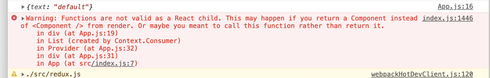

#### Render Prop

`render prop`是在组件之间通过值为函数的prop来共享代码的技术。

组件通过一个函数prop，来获取渲染的内容，这个函数返回的是react element。

```jsx
class Data extends React.Component{
  constructor(props){
    super(props)
    this.state = {
      work:'programmer'
    }
  }
  
  render(){
    return (
    	<div>{this.props.render(this.state.work)}</div>
    )
  }
}

<Data render={(work)=>(
	<h1>{work}</h1>
)} />
```

More concretely, __a render prop is a function prop that a component uses to know what to render.__

注意，这个render prop不一定叫'render'，组件用来获取所渲染内容的任何值为函数的prop都可以叫做'render prop'。

In fact, __any prop that is a function that a component uses to know what to render is technically a 'render prop'.__

我们甚至可以用`children` prop。

```jsx
<Data children={(work)=> (<h1>{work}</h1>)} />
```

而`children`可以不用声明在组件的attributes中，可以直接放在元素标签内：

```jsx
<Data>
	{(work) => (<h1>{work}</h1>)}
</Data>
```

因为这时候`children`是一个函数了，所以我们要使用`propTypes`限制一下:

```javascript
Data.propTypes = {
  chidren: PropTypes.func.isRequired
}
```


`Context.Consumer`就一个是使用函数作为`children` prop的组件。

正常情况下，一个组件不可以使用函数作为`children` prop的，要不控制台会有警告：



