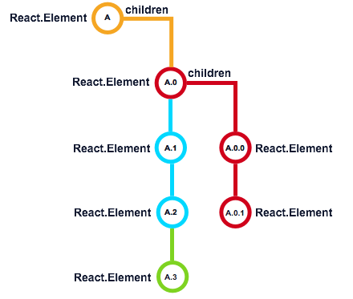

### Death/Unmount In-depth

[原文链接](https://developmentarc.gitbooks.io/react-indepth/content/life_cycle/death_unmounting_indepth.html)

​	现在来看下组件的卸载过程。在这一过程中，组件从页面上移出，相关数据也等待垃圾回收机制回收。当页面发生变化，组件的key值无法匹配后，组件就会进入卸载过程。通常这种操作会改变页面布局或者keys值发生改变，比如有新的组件实例创建（译者：不太明白这个地方的key值说的是什么）。在这一过程中，React会移除当前的组件实例及其子组件。

#### 使用`componentWillUnmount`

​	`componentWillUnmount`是组件的卸载阶段的钩子方法，有了这个方法我们就可以在组件从页面移除之前做一些清扫操作，例如撤销一些我们在`componentWillMount`或者`componentDidMount`中开始的一些操作。

​	举个例子，我们可以在这个方法里注销全局的、系统的或者其他一些已经注册的事件，又或者卸载3D工具库，等等。如果我们不做这些工作，就容易引起内存泄漏或者布局上的一些问题。

​	假设上图中，组件A.0是要被移除的，在移除时，它的`componentWillUnmount`就会先被调用，然后接下来是第一个子组件A.0.0的`componentWillUnmount`被调用，这样的一直调用下去直到最后一个子组件或者子元素。一旦所有组件的`componentWillUnmount`都被调用了，React就会把它们从UI中移出，然后等待垃圾回收来回收它们。