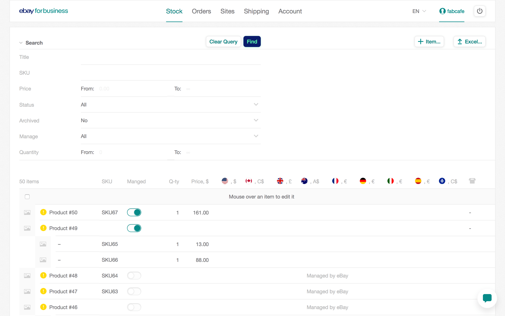
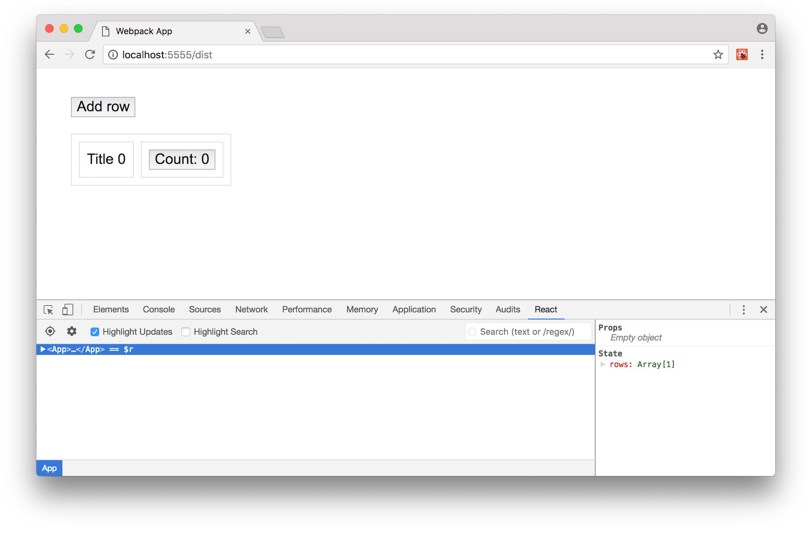
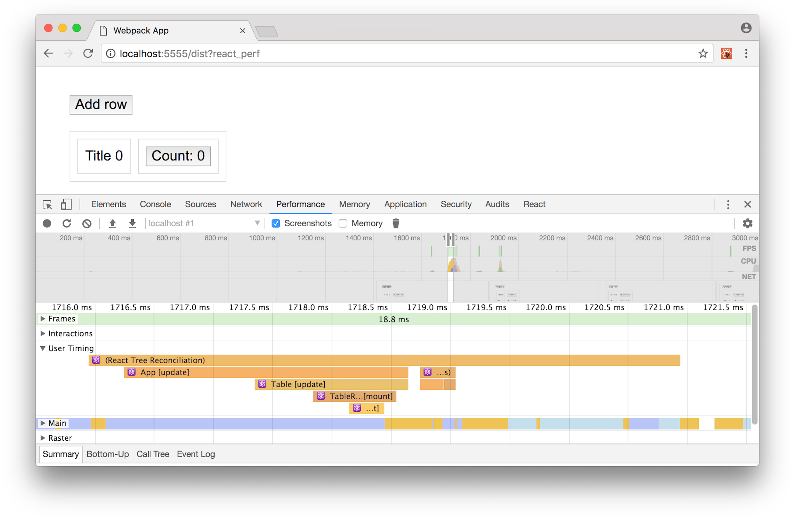

### React优化：Virtual DOM

[原文链接](https://evilmartians.com/chronicles/optimizing-react-virtual-dom-explained)

这篇文章主要介绍React的一下几个方面：

1、React是如何将JSX渲染成页面；

2、React框架的瓶颈在哪里；

3、React在使用中的一些常见的错误。

​	React一直属于前端最热的框架之一，并且目前还没有衰弱的迹象。React的学习曲线很容易被人接受，当你学会了JSX语法以及`State`和`Props`的概念时，基本就可以写React了。

​	但如果想真正的达到掌握React的目的，必须’think in React'。这篇文章有助于大家在掌握React的路上更进一步。先看下下面这个用React写成的table：



​	类似于上面的这个table，table的行数是很可观的，而且每行数据都是动态和处理过的，所以了解当前框架的一些细节对于保证用户的流畅体验就显得很重要了。

​	一般当问题出现时，页面会出现输入框反应迟缓，复选框选中需要很久，弹窗迟迟不出现等现象。

​	为了更好的解决这类问题，我们从组件定义出发到组件在页面上渲染出来为止，完成React组件的一整个生命旅程。

#### JSX语法

​	我们在写组件的时候用的都是JSX语法，一种JS和HTML混在一起的写法。对于浏览器来讲，它是不认识JSX这种语法格式的。浏览器只认识原生的Javascript，因此，我们需要把JSX语法转化成原生的Javascript。下面是个用JSX写的一个带有class属性和一些文本内容的一个div：

```jsx
<div className='cn'>
  Content!
</div>
```

​	上面这段JSX代码，转化成正常的Javascript代码的结果就是对一个带参函数的调用：

```jsx
React.createElement(
  'div',
  { className: 'cn' },
  'Content!'
);
```

​	仔细看一下上面这个函数的调用。这个函数的调用有三个入参：第一个参数是元素类型（element type），如果要渲染一个原生的HTML标签，则取值为代表HTML标签的字符串；第二个参数是元素上的属性所组成的对象，如果元素上没有属性，那么这个对象就是一个空对象；剩下的参数都是元素的子类元素。因为文本内容也是子类元素，所以字符串’Content!‘就被放到了第三个参数的位置。

​	当有多个子类元素的时候：

```jsx
<div className='cn'>
  Content 1!
  <br />
  Content 2!
</div>
```

```javascript
React.createElement(
  'div',
  { className: 'cn' },
  'Content 1!',              // 1st child
  React.createElement('br'), // 2nd child
  'Content 2!'               // 3rd child
)
```

​	现在上面这个函数的调用有了5个参数：元素类型，属性对象，3个子类元素。因为其中一个元素也是React所知的原生的HTML标签（`<br />`），所以它也会被当成一个函数调用来处理。

​	目前为止我们提到了两种类型的子类元素：一种是字符串，还有一种是调用`React.createElement`返回的结果。另外还有几种值可以作为子类元素的参数：`false`,`null`,`undefined`,`true`，数组还有React组件。

​	因为子类元素可以被放到一起作为一个元素来传递，所以数组也可以当成子元素。

```javascript
React.createElement(
  'div',
  { className: 'cn' },
  ['Content 1!', React.createElement('br'), 'Content 2!']
)
```

​	React的厉害不在于我们可以在JSX中使用原生的HTML标签，而主要在于在JSX中还可以引入我们自己创建的组件，比如：

```jsx
function Table({ rows }) {
  return (
    <table>
      {rows.map(row => (
        <tr key={row.id}>
          <td>{row.title}</td>
        </tr>
      ))}
    </table>
  );
}
```

​	组件的存在使得我们可以把我们的模板分割成若干个可重复使用的代码块。在上面的函数式组件中，我们接受一个带有表格行数据的数组，然后`<table>`作为元素类型，行作为子类元素调用`React.createElement`，并返回其运行结果。

​	当我们在代码中这样写时：

```jsx
<Table rows={rows} />
```

​	实际从浏览器角度，代码是这样的：

```javascript
React.createElement(Table, { rows: rows });
```

​	这地方要注意，第一个参数已经不是一个描述HTML标签的字符串了，变成了一个刚刚定义组建的函数的一个引用。组建的属性（attributes）就是现在的props。

#### 把组件渲染到页面上

​	现在我们已经把JSX组件转译成了原生的Javascript代码，有了一大堆函数调用，这些函数的参数会被其他函数调用，现在的问题是，这个函数是怎么变成DOM元素并组成一个页面的？

​	事实上，我们有一个`ReactDOM`库，它有一个`render`方法来做这些事情：

```javascript
function Table({ rows }) { /* ... */ } // defining a component

// rendering a component
ReactDOM.render(
  React.createElement(Table, { rows: rows }), // "creating" a component
  document.getElementById('#root') // inserting it on a page
);
```

​	当`ReactDOM.render`被调用时，`React.createElement`也会被调用并返回下面的对象：

```javascript
// There are more fields, but these are most important to us
{
  type: Table,
  props: {
    rows: rows
  },
  // ...
}
```

​	__这些对象就是React中所说的虚拟DOM（Virtual DOM）。__

​	在渲染时，这些对象会相互比较（译者：说的应该是更新时候的diffing过程）并最终转化成真实的DOM（real DOM，和virtual DOM相对）。

​	看下面这个例子，一个带有class属性和几个子元素的div：

```jsx
React.createElement(
  'div',
  { className: 'cn' },
  'Content 1!',
  'Content 2!',
);
```

​	转成虚拟DOM就是：

```javascript
{
  type: 'div',
  props: {
    className: 'cn',
    children: [
      'Content 1!',
      'Content 2!'
    ]
  }
}
```

​	注意，在`React.createElement`中，子类元素还是单独列出来的参数，到这里，变成了以children为key值的属于props对象的一个属性。由此可以看出，无论children以什么样的样式传递，数组还是列表，最终在虚拟DOM中都会以数组形式放到一起。

​	说的明白些，我们可以在JSX中就把children作为属性传递到props中，结果都是一样的：

```javascript
<div className='cn' children={['Content 1!', 'Content 2!']} />
```

​	虚拟DOM构建完毕后，`ReactDOM.render`就会尝试把虚拟DOM转换成真实的DOM来让浏览器显示，转换规则如下：

```t
1.如果type字段是个代表标签名的字符串----创建这个标签，并附带上props中所有的属性；
2.如果type字段是个函数或者是个类----调用这个函数或者创建这个类，并根据结果递归该过程；
3.如果props中含有children----逐个对子元素调用上面的逻辑并将结果放到父元素的DOM节点中。
```

​	根据上面的结果，我们的Table组件在页面渲染的结果如下：

```html
<table>
  <tr>
    <td>Title</td>
  </tr>
  ...
</table>
```

#### 重建DOM

​	注意这里说的“重建”！当我们想更新一个页面而不是全部替换时，React的魔法就开始起作用了。有几种方法可以用来更新页面。首先，最简单的一种----重复对相同节点调用`ReactDOM.render`方法。

```javascript
// Second call
ReactDOM.render(
  React.createElement(Table, { rows: rows }),
  document.getElementById('#root')
);
```

​	第二次调用时，上面的代码的表现已经和我们所看到的不一样了。它不会重新创建整个DOM节点然后把这些节点放到页面上，而是首先先通过一致性校验算法--diffing算法--来判断节点树中哪些部分需要更新，哪些根本不需要动。

​	所以，diffing算法到底是怎么工作的？我们来看下下面几个场景，理解这几个场景对优化我们的应用很有帮助。首先我们看到的是虚拟DOM中用来代表节点的对象。

* 场景一：type是个字符串，type没变，props也没变。

```javascript
// before update
{ type: 'div', props: { className: 'cn' } }

// after update
{ type: 'div', props: { className: 'cn' } }
```

​	这种情况很简单，保持原有DOM，不做任何处理。

* 场景二：type保持相同字符串没变，props改变

```javascript
// before update:
{ type: 'div', props: { className: 'cn' } }

// after update:
{ type: 'div', props: { className: 'cnn' } }
```

​	type仍然代表着原生的HTML元素，React会通过原生的DOM API来改变元素的属性（properties），并不会从DOM树中移出节点。

* 场景三：type变成了代表不同类型标签的字符串，或者干脆由字符串变成了一个组件

```javascript
// before update:
{ type: 'div', props: { className: 'cn' } }

// after update:
{ type: 'span', props: { className: 'cn' } }
```

​	这种type发生改变的情况对于React来讲，React不会采取更新操作（type都变了，更新个毛），而是直接将原有元素连其子元素移除（卸载）。所以，替换DOM树顶层元素的代价非常昂贵，所幸的是，这种情况比较少见。

​	有一点要记住，React使用`===`来比较type的值，所以如果type是个引用，则必须指向的是相同的函数或者同一个类的同一个实例才能返回true。

* 场景四：type是个component

  这种场景也是我们在React中经常用到的。

  ```javascript
  // before update:
  { type: Table, props: { rows: rows } }

  // after update:
  { type: Table, props: { rows: rows } }
  ```

  或许你会说这看起来什么都没有改变，但事实是你可能是错的。

​       如果type的值指向的是一个函数或者一个类，那么React在这个时候就会开始一致性校验的过程，会层层进入到组件内部，确保组件render方法的返回值没有发生改变（一定意义上防范副作用）。当碰上复杂的组件的时候，这种对组件的过滤和扫描的成本是很昂贵的。

#### 处理子元素、子组件

​	除了上面提到的四种场景外，我们还要说下当组件拥有一个以上的子组件时的React的行为：

```javascript
// ...
props: {
  children: [
      { type: 'div' },
      { type: 'span' },
      { type: 'br' }
  ]
},
// ...
```

​	上面这个组件有三个子元素，div、span、br，现在我们把子元素的布局顺序换一下：

```javascript
// ...
props: {
  children: [
    { type: 'span' },
    { type: 'div' },
    { type: 'br' }
  ]
},
// ...
```

​	这种情况会发生什么？

​	当开始‘diffing’的时候，React开始比较props.children下的数组。React会按照数组的索引，将数组的当前值与数组之前的值一个一个进行比较：arr[0]和arr[0]比较，arr[1]和arr[1]比较，以此类推。每一次比较都会使用上面提到的四种场景和规则。在我们这个例子中，很显然，属于第三种场景，type都是字符串但值有所改变。这里有一种非常不经济的场景：想象一下我们有一个1000行的表格，我们需要将第一行移除掉。对于React来讲，第一个子元素被移除（数组中的第一个元素），那么剩下的999个子元素都要更新，因为剩下的元素在数组中的索引全部都发生了变化。

​	不过，React有一种内置的方法来解决这个问题。如果元素带有一个key值，那么前后比较时会使用key值进行比较，而不是索引。只要key值是唯一的，那么React就会移动元素而不是删除元素然后再重建元素（React中所说的挂载和卸载）。

```javascript
// ...
props: {
  children: [ // Now React will look on key, not index
    { type: 'div', key: 'div' },
    { type: 'span', key: 'span' },
    { type: 'br', key: 'bt' }
  ]
},
// ...
```

#### 当state发生改变时

​	现在我们来看下带有状态的组件（stateful component）：

```javascript
class App extends Component {
  state = { counter: 0 }

  increment = () => this.setState({
    counter: this.state.counter + 1,
  })

  render = () => (<button onClick={this.increment}>
    {'Counter: ' + this.state.counter}
  </button>)
}
```

​	组件state中有一个counter属性，点击button一次，counter值就会增加并且button内的文本内容也会改变。那么当这些动作发生时，页面上的DOM会有哪些动作？组件的哪部分会被重新计算和更新？

​	当调用`this.setState`时会引起一次re-render，但并不是整个页面都re-render，只有当前组件和组件内部的子元素会被re-render。父元素以及兄弟元素不会受到影响。这对于想更新一整个DOM树上某一部分的情况来说是很方便的。

#### 解决问题

​	我们准备了一个小的[demo](https://iadramelk.github.io/optimizing-react-demo/dist/before.html)，你可以从demo里看到一些常见的错误，现在我们来修复这些错误，这里有[源码](https://github.com/iAdramelk/optimizing-react-demo)。在正式开始之前，你需要安装[React Developer Tools](https://github.com/facebook/react-devtools)。

​	首先我们看一下，是哪一个元素、什么时候引起了Virtual DOM更新。打开浏览器控制台中React的控制面板，然后选择Highlight Updates。



​	现在尝试增加一行表格。你可以看到，页面上每个元素四周都会出现一个边框，这说明，当我们增加一行时，React重新计算和比较了一整个Virtual DOM tree。现在尝试点击一下按钮计数器，这时候可以看到当state发生变化时，只有当前组件以及它的子元素才会被更新----这正是当state发生变化时Virtual DOM的更新策略。

​	React DevTools指出了问题所在，但没告诉我们具体的细节：特别是这些更新，是由diffing操作引起的还是说它们被卸载然后重新挂载了。为了找出原因，我们需要使用React内置的一个[工具](https://reactjs.org/docs/optimizing-performance.html#profiling-components-with-the-chrome-performance-tab)（该工具不适用于生产环境）。

​	将?react_perf添加到你应用的URL后面，然后打开开发者工具的Performance面板。点击记录按钮然后操作表格--添加一些行，点击一些计数器--然后点击停止。



​	我们主要关注结果中的User timing。放大时间轴，直到看到“React Tree Reconciliation”这一组和它的子项。这些都是我们的组件，它们旁边都写的更新（update）或者挂载（mount）。

​	我们的大部分问题基本都属于下面这两类：

* 组件（或者组件产生的其他分支）的每次更新都是卸载然后重新挂载（re-mounted）
* 针对一个大的Virtual DOM树做一致性校验花费很昂贵，即使最终结果是没有发生任何变化。

#### 解决问题：挂载/卸载

​	我们已经知道了React是根据什么去更新Virtual DOM的了，也看到了更新后面的一些细节，现在让我们来解决一些问题，首先是挂载和卸载的问题。

​	当你知道，一个包含多个子元素或者子组件的组件在内部其实使用数组的方式来盛装子元素时，你就可以很显著的提升性能。看例子：

```
<div>
  <Message />
  <Table />
  <Footer />
</div>
```

在virtual DOM中实际是这样：

```javascript
// ...
props: {
  children: [
    { type: Message },
    { type: Table },
    { type: Footer }
  ]
}
// ...
```

​	一个Message组件内部是一个div包含着一些文本，一个巨大的表格，大概有1000多行，这两个都是一个div的子元素，所以它们都被放在了父节点的props.children属性下，同时，它们都没有key值。React并不会在控制台提示我们给每个子元素添加一个key值，因为子元素是以列表参数的方式传递给React.createElement的，并不是数组（And React will not even remind us to assign keys through console warnings, as children are being passed to the parent’s `React.createElement` as a list of arguments, not an array.----译者对这句话有些不明白，言外之意，直接用数组的方式传递子元素就会提示添加key值了么----是的，如果直接以数组方式传入子组件，控制台就是提示需要给数组中的元素添加key属性。

```javascript
index.js:2178 Warning: Each child in an array or iterator should have a unique "key" prop.

Check the render method of `Container`. See https://fb.me/react-warning-keys for more information.
    in ChildOne (created by Container)
    in Container (at App.js:23)
    in div (at App.js:18)
    in App (at index.js:23)
    in div (at index.js:22)
    in Provider (at index.js:21)
```

）。

​	现在我们去掉Message组件，只剩下Table和Footer。

```javascript
// ...
props: {
  children: [
    { type: Table },
    { type: Footer }
  ]
}
// ...
```

​	在React看来，盛装子元素的数组发生了变化：children[0]本来放的是Message，现在放的是Table，同时因为不存在key值可以用来比较，所以只能比较type值，而这两者又都是指向函数的引用（指向的是不同的函数），因此，React在这地方会卸载然后重新加载页面上存在过的Table和它的子元素----1000多行的数据。

​	你可以给子元素添加key值（这在这个例子中不是最好的方法）来解决问题，或者采用更好的方法：[短路逻辑](https://developer.mozilla.org/en-US/docs/Web/JavaScript/Reference/Operators/Logical_Operators)----javascript和其他流行语言都有的一个特性：

```javascript
// Using a boolean trick
<div>
  {isShown && <Message />}
  <Table />
  <Footer />
</div>
```

​	尽管Message被从页面中移除，父组件div的props.children数组依然含有三个元素，children[0]是一个原始布尔值，false。还记不记得，true/false，null和undefined都可以作为Virtual DOM中组件对象type字段的值？上面的代码最终编译成Virtual DOM如下面这样：

```javascript
// ...
props: {
  children: [
    false, //  isShown && <Message /> evaluates to false
    { type: Table },
    { type: Footer }
  ]
}
// ...
```

​	所以不管Message存不存在，props.children内部的索引不会变，diffing时，Table依然和Table比较（当type指向组件的引用时会进行diffing比较），而且这种比较比移除DOM然后再重新创建要快得多。

​	现在来进阶的看一些东西。我们都喜欢用HOC（高阶组件）----使用一个组件作为入参，经过处理后返回另一个组件的函数：

```javascript
function withName(SomeComponent) {
  // Computing name, possibly expensive...
  return function(props) {
    return <SomeComponent {...props} name={name} />;
  }
}
```

​	在使用时我们要小心一种写法：

```javascript
class App extends React.Component() {
  render() {
    // Creates a new instance on each render
    const ComponentWithName = withName(SomeComponent);
    return <SomeComponentWithName />;
  }
}
```

​	我们在上面这个组件的render方法里创建了一个高阶组件，当我们re-render的时候，Virtual DOM大概是这个样子：

```javascript
// On first render:
{
  type: ComponentWithName,
  props: {},
}

// On second render:
{
  type: ComponentWithName, // Same name, but different instance
  props: {},
}
```

​	re-render时，React会去对ComponentWithName进行diffing比较，但是ComponentWithName两次指向的都不是同一个实例，全等比较（`===`）返回的是false，这时候就会发生re-mount。这种情况还会造成状态丢失，[看这里](https://github.com/facebook/react/blob/044015760883d03f060301a15beef17909abbf71/docs/docs/higher-order-components.md#dont-use-hocs-inside-the-render-method)。不过，解决这类问题的方法也很简单：在render外创建HOC：

```javascript
// Creates a new instance just once
const ComponentWithName = withName(Component);

class App extends React.Component() {
  render() {
    return <ComponentWithName />;
  }
}
```

#### 解决问题：更新

​	现在，除了必要情况，我们已经能确保不会再有re-mount的烦恼了。但是，当靠近DOM树根部的一些组件发生变化时，会引起React对其及所有其子组件进行diffing过程。如果DOM树结构复杂，这笔开销是很昂贵的。不过，可以避免。

​	如果有一种方法可以告诉React当前组件不用看了，我们很确定它没有变化，那就太好了。很幸运，这种方法存在----shouldComponentUpdate----这是组件生命周期中的一个方法。组件re-render前，这个方法都会被调用一次，并以props和state的最新值作为入参。有了这个方法和参数，我们就可以很自由的比较props和state前后各自的变化然后决定是否更新组件。如果方法返回false，React不会re-render组件也更不会再去关心子元素。

​	通常，对props和state做一次浅比较就一够了：如果顶层的数据发生了改变，就没必要进行更深一层的比较了，直接进行更新；相反，如果顶层数据没有改变，则就不进行更新。浅比较并不是Javascript的特性，但是有很多[工具库](https://github.com/dashed/shallowequal)可以帮我们做这些事情。有了浅比较，我们可以这样写代码：

```javascript
class TableRow extends React.Component {

  // will return true if new props/state are different from old ones
  shouldComponentUpdate(nextProps, nextState) {
    const { props, state } = this;
    return !shallowequal(props, nextProps)
           && !shallowequal(state, nextState);
  }

  render() { /* ... */ }
}
```

​	但是React有一个内置的组件类----React.pureComponent----它和React.Component类似，不同在于前者已经用浅比较把shouldComponentUpdate实现好了，所以你不用再去在shouldComponentUpdate里写浅比较了。

​	继承PureComponent类然后就可以享受高性能，这听起来是有点傻瓜式的用法。但其实不是那样，有些地方还是要注意的，看例子：

```javascript
<Table
    // map returns a new instance of array so shallow comparison will fail
    rows={rows.map(/* ... */)}
    // object literal is always "different" from predecessor
    style={ { color: 'red' } }
    // arrow function is a new unnamed thing in the scope, so there will always be a full diffing
    onUpdate={() => { /* ... */ }}
/>
```

​	上面的代码展示了三种错误的例子，要尽量避免。

​	如果你能保证你在render函数之外定义对象、数组和函数，并确保在组件调用期间不发生改变，那正常情况下你的组件在性能上不会有太大问题。

​	你可以看下更新后的[demo](https://iadramelk.github.io/optimizing-react-demo/dist/after.html)，这里，表格的每一行都是继承的PureComponent。打开React DevTools的Hight Updates选项，你会看到，只有表格和新添加的行发生了渲染，其他行保持着不变。

​	如果你想让所有组件都继承自PureComponent，还是不要这么做。浅比较props和state并不是免费的，对于大多数组件来说甚至有点不值得，因为对它们来说，浅比较会比diffing算法花费更长的时间。