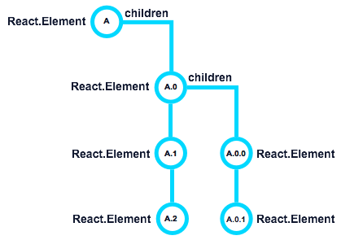

### `componentDidMount()`

[原文链接](https://developmentarc.gitbooks.io/react-indepth/content/life_cycle/birth/post_mount_with_component_did_mount.html)

​	`componentDidMount()`是组件诞生阶段最后一个生命周期函数。当当前组件以及子组件渲染完毕挂载到UI上时，这个方法就会被调用，而且在整个生命周期中，这个函数只会被调用一次。在这个函数内部，我们能够获取到页面上的UI元素，指向子元素的`refs`以及还可以触发另一次render过程。

__调用顺序：__

​	和`componentWillMount()`一样，`componentDidMount()`也只会调用一次。诞生阶段的其他方法都是按照从顶层（父组件）到底层（子组件）的顺序执行的，而`componentDidMount`是按照从底层子组件开始到顶层父组件的顺序执行的。我们看下下面结构的组件：



​	像上面结构的组件，其`render()`方法的执行顺序是下面的顺序：

> ```
>  A -> A.0 -> A.0.0 -> A.0.1 -> A.1 -> A.2.
> ```

​	而`componentDidMount()`从底下往上开始：

> ```
> A.2 -> A.1 -> A.0.1 -> A.0.0 -> A.0 -> A
> ```

​	当执行到当前组件的`componentDidMount()`方法时，我们就知道当前组件的子组件已经渲染完毕，并且已经运行了自己的`componentDidMount()`方法。这种从后往前的运行顺序保证了在父组件的`componentDidMount()`内部可以获取到其 子组件以及自身的UI元素。

我们来看下面这个例子：

GrandChild.js

```react
/** 
 * GrandChild
 * It logs the componentDidMount() and has a public method called value.
 */ 
import React from 'react';
import ReactDOM from 'react-dom';

export default class GrandChild extends React.Component {

  componentDidMount() {
    console.log('GrandChild did mount.');
  }

  value() {
    return ReactDOM.findDOMNode(this.refs.input).value;
  }

  render() {
    return (
      <div>
        GrandChild
        <input ref="input" type="text" defaultValue="foo" />
      </div>
    );
  }
}
```

Child.js

```react
/*
 * Child
 * It logs the componentDidMount() and has a public method called value,
 * which returns the GrandChild value.
 */
import React from 'react';
import GrandChild from './GrandChild';

export default class Child extends React.Component {

  componentDidMount() {
    console.log('Child did mount.');
  }

  value() {
    return this.refs.grandChild.value();
  }

  render() {
    return (
      <div>
        Child
        <GrandChild ref="grandChild" />
      </div>
    );
  }
}
```

Parent.js

```react
/*
 * Parent
 * It logs the componentDidMount() and then logs the child value()
 * method.
 */
import React from 'react';
import Child from './Child';

export default class Parent extends React.Component {

  componentDidMount() {
    console.log('Parent did mount.');
    console.log('Child value:', this.refs.child.value());
  }

  render() {
    return (
      <div>
        Parent
        <Child ref="child" />
      </div>
    );
  }
}
```

​	当页面挂载`<Parent />`时，我们在控制台中可以看到如下输出：

```react
GrandChild did mount.
Child did mount.
Parent did mount.
Child value: foo
```

​	很明显，最里层的组件GrandChild的`componentDidMount()`是最先被调用的，紧接着的是Child的，然后才是Parent的。因为调用`componentDidMount()`时，当前组件和子组件都已经挂载，所以在Parent内部可以获取自身内部的`refs`属性值，而GrandChild可以获取到自己的DOM节点。

__用处:__

​	我们可以在`componentDidMount()`获取到页面UI元素。

​	例如，基于已经渲染出来的UI布局，我们需要更改我们当前的state，然后就需要子组件或者自身的宽高来做一些计算，这些逻辑就可以放到`componentDidMount()`中。

​	另一个用处是，在`componentDidMount()`中启动3rd框架。例如，如果我们使用C3.js或者Date Range Picker，我们就需要在`componentDidMount()`来初始化我们的UI库。

__启动另一个render过程：__

​	有些很少见的情况下我们需要在组件挂载后立即进行第二次渲染，这种情况很少见，通常只发生于挂载后需要根据布局改变当前state的情况。例如在表格中，根据表格第一次渲染的结果，以及行高或者列宽进行一些动态计算，以对组件子元素或者子组件进行重新布局。

​	如果你需要上面提到的功能，你可以在`componentDidMount()`中调用`this.setState()`或者`forceUpdate()`。如果你改变了state或者进行了一次强制更新，你的组件将会开始另一个render过程并进入更新阶段。因为`compoentDidMount()`在整个生命周期中只调用一次，所以我们不用担心会进入一个无限循环。

```
 But, this process can lead to issues down the road if you do not take the time to walk through all the potential ramifications of multiple renders.
```

​	最后一句读不懂是什么意思。什么叫：如果不处理多次render的产生的潜在结果，会导致问题

