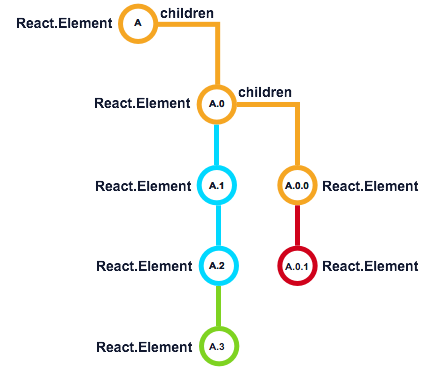

#### Re-rendering and Children Updates

[原文链接](https://developmentarc.gitbooks.io/react-indepth/content/life_cycle/update/rerendering_and_children_updates.html)

​	现在我们再来说一下`render`方法。当组建的`props`和`state`发生改变后，就需要让这些改变体现到组件和子组件上，这时候初次渲染时的一些规则在这个地方也一样适用。

​	在re-render时，组件和子组件的产生和初次渲染有较大差别。

​	React在这个时候会比较`render`方法前后返回的值是否发生变化，对于子元素，会将`props.children`中的元素按照__索引__比较前后变化，或者，如果子元素都带有key值，则__通过key值__（相同key值的在一起比较，而不是相同索引的在一起比较了）比较是否发生变化。通过比较，React会知道我们是否有新的实例生成（A.3），是否需要移除已有实例（A.0.1）或者是否需要更新已有实例（A,A.0,A.0.0）。

​	如果key值相同，仅仅是props发生了变化，则仅将props传到组件内部，然后开始组件的更新过程（diff过程：如果是原生的html标签就只是通过原生的DOM API改变元素的属性，对DOM结构不做更改；如果是react组件，则还要进入到组件内部，然后同样的去比较组件内部元素是否有变化，无变化的不动，有变化的更新或者卸载，有新增节点的就去创建；如果组件内部还有其他react组件，则按照上面的规则递归。说白了就是遍历比较两颗树）。如果增加了新组件或者变更了组件的key值，React就会创建新的组件实例，然后这个组件就会进入到挂载阶段。

​	其实更新就是两颗树的比较。一个react组件下面会有子元素，也就是叶子节点，叶子节点又可以作为根节点拥有叶子节点，最终react元素会展现成一颗代表真实DOM的虚拟DOM树。这棵树是根据当前组件的props和state计算生成的，所以，props或者state有变化也会在这颗树上有所体现。

​	在比较具体的节点时，又大致会碰到四种情况：一种，type是代表html标签的字符串并且没有发生变化，props也没有变化，这种情况不做更新；二种，type是代表html的字符串，并且没有发生变化，但是props发生了变化，这种情况就使用原生的DOM API去改变元素的属性；三种，type发生了变化，这种情况直接卸载老的节点，创建新节点并添加到DOM树上去；四种：type为代表react组件的对象。这个时候就不要去管props和state变没变了，这个时候要比较的已经不是单纯的外在的这个react组件了，要比较的是这个组件内部的东西。要把组件拆开，按照上面四种类型来比较内部元素。

​	因为state是组件内部的变量，所以如果state发生了变化，仅仅比较当前组件就可以了。相比较而言，props变动带来的更新可能会比state要大。