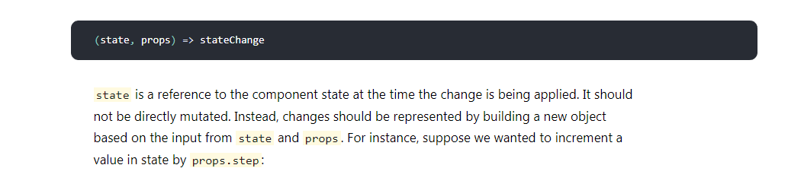

App.js

```jsx
import React, { Component } from 'react';
import Item from './Item';
import './App.css';

class App extends Component {
  state = {
    items: [
      {text: "First",id: 1},
      {text: "Second",id: 2}
    ]
  };

  addItem = () => {
    const items = [{ text: "Front", id: Date.now() }, ...this.state.items];
    items[1].text = 'fff'
    this.setState({ items });
  };

  render() {
    const {items} = this.state;
    setTimeout(()=>{  //这地方设了一个定时器（我知道render里面不能设置定时器）
      items[1].text = 'ssss';
      this.setState({items})
    }, 3000)
    return (
      <div>
        <ul>
          {items.map((item, index) => (
            <Item item={item} key={index} />
          ))}
        </ul>
        <button onClick={this.addItem}>Add Item</button>
      </div>)
  }
}

export default App;

```


Item.js

```jsx
import React from "react";
import { render } from "react-dom";

class Item extends React.Component {
  constructor(props){
    super(props);
    console.log('initial component')
    this.state = {
      item: this.props.item
    };
  }

  onChange = event => {
    this.setState({
      text: event.target.value
    });
  };


  render() {
    const { item } = this.state;
    return (
      <li>
        <input value={this.props.item.text} onChange={this.onChange} />
      </li>
    );
  }
}

export default Item;
```

在`App`de `render`方法中有一个定时器，3s后会修改`item`的值，然后进行`setState`操作。预期结果是页面能同步反应修改效果。

但实际结果是3s后页面并没有反应。

原因有两个：

1.`Item`组件使用`PureComponent`，自带`shouldComponentUpdate()`方法，会浅比较`props`和`state`，以确定是否需要更新组件

2.`App`中在修改`state`时直接修改了源变量（`state`发生了突变），没有新建对象，导致`PureComponent`中比较props的结果为未改变，所以`Item`也就不会重新渲染



