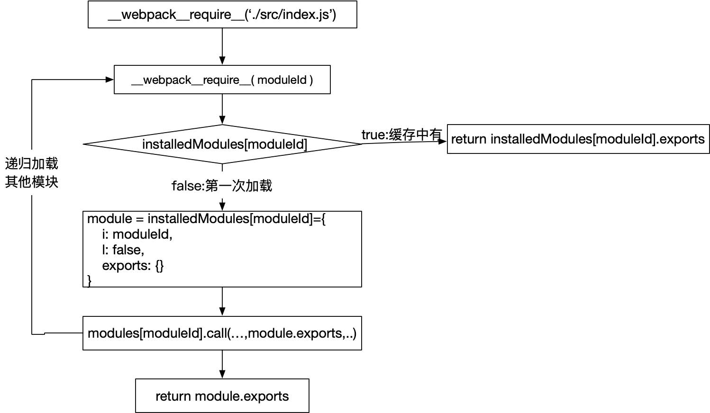

### webpack是如何加载模块的（一）：同步模块的加载

先看下同步加载代码。

入口文件index.js:

```javascript
import text from './sync.js'
console.log(text)
```

被导入文件sync.js：

```javascript
const text = 'sync';
export default text;
```


打包后获得如下的文件：index.bundle.js（先忽略细节，看下整体结构）

```javascript
(function (modules) { // webpackBootstrap
  // The module cache
  var installedModules = {};
  // The require function
  function __webpack_require__(moduleId) {
    //...
    return module.exports;
  }
 	// ...
  // ...
  return __webpack_require__(__webpack_require__.s = "./src/index.js");
})
  ({
    "./src/index.js":
      (function (module, __webpack_exports__, __webpack_require__) {
        "use strict";
        __webpack_require__.r(__webpack_exports__);
        var _syncc_js__WEBPACK_IMPORTED_MODULE_0__ = 
            __webpack_require__(/*! ./syncc.js */ "./src/syncc.js");
        console.log(_syncc_js__WEBPACK_IMPORTED_MODULE_0__["default"]);
      }),
    "./src/sync.js":
      (function (module, __webpack_exports__, __webpack_require__) {
        "use strict";
        __webpack_require__.r(__webpack_exports__);
        var text = 'sync';
        __webpack_exports__["default"] = (text);

      })
  });
```

可以看出，打包出的源码就是一个立即执行函数，前半部分是方法主体，后半部分是方法入参。入参是一个对象，对象的key是被打包文件的路径，而value值为一个方法，方法内运行的是模块内容。姑且把整个对象叫做模块对象。

在前半部分的函数体结尾，执行了`__webpack_require__(__webpack_require__.s = "./src/index.js");`方法，整个程序其实也是从这里开始。

`__webpack__require(moduleId)`：根据传入的moduleId加载对应的模块并缓存，最后返回模块导出的内容

```javascript
// 模块缓存
var installedModules = {};
function __webpack_require__(moduleId) {
  // 检测要加载的文件是否已经缓存，若缓存过了直接返回文件导出值
  if (installedModules[moduleId]) {
    return installedModules[moduleId].exports;
  }
  // 没有加载过，创建module对象，并将这个对象放到缓存中
  var module = installedModules[moduleId] = {
    i: moduleId,
    l: false,
    exports: {}
  };

  // 执行当前moduleId对应的函数，执行模块内代码
  modules[moduleId].call(module.exports, module, module.exports, __webpack_require__);

  // 把当前模块标识为已加载
  module.l = true;

  // 返回模块
  return module.exports;
}
```

上面的方法中比较重要的是下面这一句：

```javascript
modules[moduleId].call(module.exports, module, module.exports, __webpack_require__);
```

读取`moduleId`对应的模块加载方法并执行。

`modules`就是传入进来的模块对象：

```javascript
{
  "./src/index.js": (function (module, __webpack_exports__, __webpack_require__) {
    "use strict";
    __webpack_require__.r(__webpack_exports__);
    var _syncc_js__WEBPACK_IMPORTED_MODULE_0__ = 
        __webpack_require__(/*! ./syncc.js */ "./src/syncc.js");
    console.log(_syncc_js__WEBPACK_IMPORTED_MODULE_0__["default"]);
  }),
  "./src/sync.js": (function (module, __webpack_exports__, __webpack_require__) {
      "use strict";
      __webpack_require__.r(__webpack_exports__);
      var text = 'sync';
      __webpack_exports__["default"] = (text);
    })
  }
```

所以，`modules['./src/index.js'].call(...)`其实就是执行的下面这个函数：

```javascript
function (module, __webpack_exports__, __webpack_require__) {
  "use strict";
  __webpack_require__.r(__webpack_exports__);
  var _syncc_js__WEBPACK_IMPORTED_MODULE_0__ = 
      __webpack_require__(/*! ./sync.js */ "./src/sync.js");
  console.log(_syncc_js__WEBPACK_IMPORTED_MODULE_0__["default"]);
}
```

上面方法中先是执行了`__webpack_require__.r`：

```javascript
// 给文件导出对象定义_esModule属性并复制为true，
// 同时通过修改Symbol.toStringTag属性
// 将export对象的toString()方法返回值设置为[object Module]
__webpack_require__.r = function (exports) {
  if (typeof Symbol !== 'undefined' && Symbol.toStringTag) {
    Object.defineProperty(exports, Symbol.toStringTag, { value: 'Module' });
  }
  Object.defineProperty(exports, '__esModule', { value: true });
};
```

接下来就是index.js源代码文件中的内容了：

```javascript
var _syncc_js__WEBPACK_IMPORTED_MODULE_0__ = 
      __webpack_require__(/*! ./syncc.js */ "./src/sync.js");
 console.log(_syncc_js__WEBPACK_IMPORTED_MODULE_0__["default"]);
```

先是导入`sync.js`中的内容，然后打印输出所导入内容，和`index.js`源码内容一致：

```javascript
import text from './syncc.js'
console.log(text)
```

在导入`sync.js`时，依然是使用`__webpack_require__()`方法，入参是`./src/sync.js`：

```javascript
// 加载sync.js
__webpack_require__("./src/sync.js");
```

同样的，加载`sync.js`时也是先去缓存中看一下之前有没有加载过这个模块，没有的话再去加载：

```javascript
modules[moduleId].call(module.exports, module, module.exports, __webpack_require__);
```

执行对应的模块加载方法：

```javascript
function (module, __webpack_exports__, __webpack_require__) {
  "use strict";
  __webpack_require__.r(__webpack_exports__);
  var text = 'sync';
  __webpack_exports__["default"] = (text);
}
```

可以看到模块导出的内容挂在`__webpack_exports__`对象下面：

```javascript
__webpack__exports__["default"] = (text);
```

对于每个没有加载过的模块，在加载之前都会创建一个`module`对象:

```javascript
// 没有加载过，创建module对象，并将这个对象放到缓存中
  var module = installedModules[moduleId] = {
    i: moduleId,
    l: false,
    exports: {}
  };
```

而模块加载方法内的`__webpack__exports__`就是传入进来的`module.exports`对象，在`__webapck__require__()`方法最后返回`module.exports`，所以要导出的内容就被返回了。


总结一下，每个模块在编译之后都是一个函数，这些函数挂在模块对象下，以自己的文件路径为属性key，类似下面的结构：

```javascript
{
	'./src/index.js': (function(){
	  // ...
	  // 加载其他模块
	}),
	..
	[moduleId]: (function(){
	  //..
	})
}
```


模块的加载过程主要用到的就是`__webpack_require__(moduleId)`这个方法。加载流程就是先加载入口模块（index.js），如果当前模块内部又引用了其他模块（sync.js），则继续使用`__webpack_require__(moduleId)`去加载，这样一直**递归**加载下去，直到所有模块都加载完毕。对于每个加载过的模块都会被缓存起来（存储在`installedModules[moduleId]`下），后续再次用到时会直接去缓存中获取而不用再去执行一次模块。




