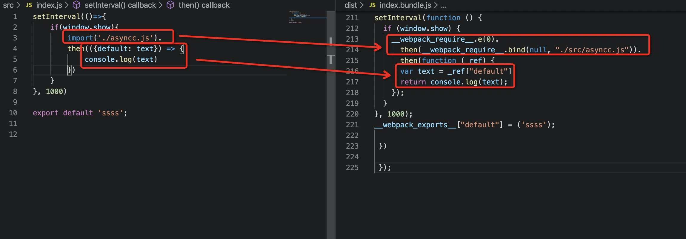
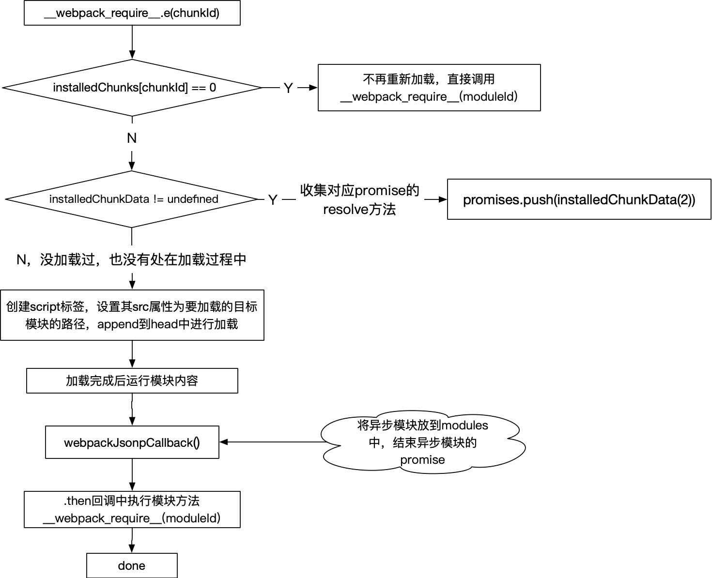

### webpack是如何加载模块的（二）：异步模块的加载

webpack可以把项目代码打包成一个bundle.js，如果项目比较大的话，这个bundle.js体积也会比较大。如果用户打开首页上来就加载一个很大的文件的话，一定程度上会影响用户的体验。而且，这个bundle.js还包含了一些用户不常访问的页面，这不经常访问的页面没有必要打包进去（因为访问几率比较低），可以在访问时再去加载这个页面的代码。这样减少了初次加载的bundle.js的体积，可以提高初次访问时页面打开的速度。但是这种方式也增加了http请求次数，因为要去按需加载，同时还要加载一些控制按需加载的代码。所以，在使用webpack按需加载进行项目优化时，需要综合考虑。

有两种按需加载的实现方式，一种是使用正在处于ECMAScript提议阶段的import()语法；另一种是使用webpack自己的规范require.ensure。

> import()内部使用promise实现。因此在老的浏览器中使用的话要注意兼容。

本文接下来研究的是通过`import()`方法加载异步模块的实现。

同样是两个文件：

index.js

```javascript
setInterval(()=>{
  if(window.show){
    import('./asyncc.js').then(({default: text}) => console.log(text))
  }
}, 1000)
```

async.js

```javascript
const text='async'
export default text;
```


打包后获得两个文件，先忽略细节，看结构

index.bundle.js：

```javascript
(function(modules) { 
  function webpackJsonpCallback(data) {
    // ...
  };
  // 模块缓存
  var installedModules = {};
  // 已加载（0）/待加载（undefined）/预加载（preloaded）/正在加载（promise）的模块
  var installedChunks = {
    "index": 0
  };
   
  function jsonpScriptSrc(chunkId) {
    // ...
  }
   
  // The require function
  function __webpack_require__(moduleId) {
    // ...
  }

  __webpack_require__.e = function requireEnsure(chunkId) {
    // ...
 };
  return __webpack_require__(__webpack_require__.s = "./src/index.js");
 })({
 "./src/index.js":
   (function(module, __webpack_exports__, __webpack_require__) {
    "use strict";
    __webpack_require__.r(__webpack_exports__);
    setInterval(function () {
      if (window.show) {
        __webpack_require__.e(/*! import() */ 0).
        then(__webpack_require__.bind(null, "./src/asyncc.js")).
        then(function (_ref) {
          var text = _ref["default"];
          return console.log(text);
        });
      }
    }, 1000);
    __webpack_exports__["default"] = ('ssss');
   })
 });
```

0.bundle.js：

```javascript
(window["webpackJsonp"] = window["webpackJsonp"] || []).push([[0],{
"./src/asyncc.js":
  (function(module, __webpack_exports__, __webpack_require__) {
    "use strict";
    __webpack_require__.r(__webpack_exports__);
    var text = 'async';
    __webpack_exports__["default"] = (text);
  })
}]);
```


从整体看打包后文件结构和都是同步加载时的打包文件结构差不多：都是一个立即执行函数，函数入参同样也是一个以文件路径为key，文件内容为值的对象（姑且称之为**模块对象**）；同样使用了`__webpack_require__(moduleId)`加载同步代码；同样有模块缓存`installedModules`。

也有一些不同点，比如，相比都是同步加载，使用异步加载的代码打包后文件内容要多一些，有一些方法在同步加载时没有（比如webpackJsonpCallback，jsonpScriptSrc）；需要同步加载的所有文件都打包在了一块，但需要异步加载的文件单独打包了出来（0.bundle.js）；对模块的加载状态进行了记录`installedChunks`。

对于同步文件的加载依然是使用`__webpack_require__(moduleId)`来加载，具体解析可以看上一篇文章。下面看下index.js中是如何加载async.js的。

```javascript
{
 "./src/index.js":(function(module, __webpack_exports__, __webpack_require__) {
    "use strict";
    __webpack_require__.r(__webpack_exports__);
    setInterval(function () {
      if (window.show) {
        __webpack_require__.e(/*! import() */ 0).
        then(__webpack_require__.bind(null, "./src/asyncc.js")).
        then(function (_ref) {
          var text = _ref["default"];
          return console.log(text);
        });
      }
    }, 1000);
    __webpack_exports__["default"] = ('ssss');
   })
 }
```

以上是index.js编译后得到的内容。对照源码可以看到原来的`import('./async')`被编译成了`__webpack__require__.e(0)`，`__webpack__require__.e`方法源码如下：

```javascript
__webpack_require__.e = function requireEnsure(chunkId) {
  var promises = [];
  var installedChunkData = installedChunks[chunkId];
  if(installedChunkData !== 0) { // 0 表示已经加载过
    // 正在加载
    if(installedChunkData) {
      promises.push(installedChunkData[2]);
    } else {
      // 创建promise，并存放到缓存installedChunks中
      var promise = new Promise(function(resolve, reject) {
        installedChunkData = installedChunks[chunkId] = [resolve, reject];
      });
      promises.push(installedChunkData[2] = promise);

      // 开始加载异步模块
      // 创建script标签
      var script = document.createElement('script');
      var onScriptComplete;
      // 设置字符集
      script.charset = 'utf-8';
      // 设置超时时间
      script.timeout = 120;
      if (__webpack_require__.nc) {
        script.setAttribute("nonce", __webpack_require__.nc);
      }
      // 设置src
      script.src = jsonpScriptSrc(chunkId);

      var error = new Error();
      // 加载完成/超时/出错 事件响应方法
      onScriptComplete = function (event) {
        // 避免IE中出现内存泄漏
        script.onerror = script.onload = null; 
        // 清除定时器
        clearTimeout(timeout);
        var chunk = installedChunks[chunkId];
          if(chunk !== 0) {
            if(chunk) {
              // 设置错误信息
              var errorType = event && (event.type === 'load' ? 'missing' : event.type);
              var realSrc = event && event.target && event.target.src;
              error.message = 'Loading chunk ' + chunkId + ' failed.\n(' + errorType + ': ' + realSrc + ')';
              error.name = 'ChunkLoadError';
              error.type = errorType;
              error.request = realSrc;
              chunk[1](error);
            }
            installedChunks[chunkId] = undefined;
          }
        };
        // 定时器，超时后触发
        var timeout = setTimeout(function(){
          onScriptComplete({ type: 'timeout', target: script });
        }, 120000);
        script.onerror = script.onload = onScriptComplete;
        // 将script标签添加到head内，开始加载脚本
        document.head.appendChild(script);
      }
    }
    return Promise.all(promises);
  };
```

上面一段代码看着东西挺多，但其实做的事情挺简单：

1. 检查要加载的代码是否已经加载过，加载过则直接返回，否则继续往下走；

2. 创建一个代表即将要加载的代码的promise，并将这个promise存储到内存中供后面使用；
3. 接着就是创建script标签，设置script的一些包括src在内的属性，然后将scirpt标签append到head内，浏览器就会自动根据src去加载代码

在设置加载路径也就是script的src属性时，用到了`jsonpScriptSrc(chunkId)`这个方法：

```javascript
function jsonpScriptSrc(chunkId) {
  return __webpack_require__.p + "" + ({}[chunkId]||chunkId) + ".bundlle.js"
}
```

方法很简单，就是根据传进来的chunkId生成对应的chunk路径，这里的`__webpack__require__.p`就是webpack配置中的`publicPath`。我们这个例子中没有设置`publicPath`，所以`src`值为`0.bundle.js`。

所加载的0.bundle.js内容如下，也就是async.js打包后的内容：

```javascript
(window["webpackJsonp"] = window["webpackJsonp"] || []).push([[0],{
"./src/asyncc.js":(function(module, __webpack_exports__, __webpack_require__) {
    "use strict";
    __webpack_require__.r(__webpack_exports__);
    var text = 'async';
    __webpack_exports__["default"] = (text);

  })
}]);
```

这段代码中先是用到了`window.webpackJsonp.push`方法，这个方法在主打包文件index.bundle.js中可以找到定义：

```javascript
var jsonpArray = window["webpackJsonp"] = window["webpackJsonp"] || [];
var oldJsonpFunction = jsonpArray.push.bind(jsonpArray);
jsonpArray.push = webpackJsonpCallback;
```

所以`window.webpackJsonp.push`其实就是`webpackJsonpCallback()`方法，方法内容如下：

```javascript
function webpackJsonpCallback(data) {
  var chunkIds = data[0];
  var moreModules = data[1];

  
  var moduleId, chunkId, i = 0, resolves = [];
  for(;i < chunkIds.length; i++) {
    chunkId = chunkIds[i];
    if(Object.prototype.hasOwnProperty.call(installedChunks, chunkId) && installedChunks[chunkId]) {
      // 收集各模块的resolve方法，供后面统一处理
      resolves.push(installedChunks[chunkId][0]);
    }
    installedChunks[chunkId] = 0; // 加载完成后，对应模块在installedChunks中的值为0
  }
  // 将加载的模块添加到modules对象上
  for(moduleId in moreModules) {
    if(Object.prototype.hasOwnProperty.call(moreModules, moduleId)) {
      modules[moduleId] = moreModules[moduleId]; // 将异步加载到的模块放到modules中
    }
  }
  if(parentJsonpFunction) parentJsonpFunction(data);

  while(resolves.length) {
    resolves.shift()(); // 执行resolve，结束promise
  }
};
```

结合0.bundle.js代码，`webpackJsonCallback()`主要作用有三个：

1. 将异步加载到的模块对象放到`modules`变量中

modules是外层函数的入参，这个不要忘了。

```javascript
for(moduleId in moreModules) {
  if(Object.prototype.hasOwnProperty.call(moreModules, moduleId)) {
    modules[moduleId] = moreModules[moduleId]; // 将异步加载到的模块放到modules中
  }
}
```

2. 将已经加载的模块标记为已加载

```javascript
installedChunks[chunkId] = 0; // 加载完成后，对应模块在installedChunks中的值为0
```

3. 将异步模块对应的promise结束掉

```javascript
// ...
resolves.push(installedChunks[chunkId][0]);
// ...
while(resolves.length) {
  resolves.shift()(); // 执行resolve，结束promise
}
```

可以注意到，在结束promise时，并没有把模块内容resolve出去，所以这个模块内容是如何被引入的（每个模块都是一个方法，方法要被执行模块内容才能被引入）？

上面提到，`webpackJsonCallback()`这个方法会将模块对象加入到`modules`对象中：

```javascript
for(moduleId in moreModules) {
  if(Object.prototype.hasOwnProperty.call(moreModules, moduleId)) {
    modules[moduleId] = moreModules[moduleId]; // 将异步加载到的模块放到modules中
  }
}
```

既然放进去了，那肯定有用到的地方。

回到index.bundle.js中，拖到代码最下面加载async.js部分：

```javascript
if (window.show) {
  __webpack_require__.e(/*! import() */ 0).
   then(__webpack_require__.bind(null, "./src/async.js")).
   then(function (_ref) {
  var text = _ref["default"];
  return console.log(text);
});
```

可以看到，在异步文件加载结束后（就是promise结束后）接着调用的是`__webpack__require__('./src/async.js')`方法，入参是`'./src/async.js'`，接下里的事情就很明显了：`__webpack__require__()`方法根据moduleId----`./src/async.js`去modules中加载模块，运行模块内容，接着返回模块要导出的内容。因为这里`__webpack__require__`方法是作为`then()`方法的第一个参数运行的，所以其返回内容可以被紧跟后面的`.then()`方法捕捉到，在后面的`.then()`方法中执行的就是源码中需要在async.js加载完成才能运行的代码了。



至此，整个异步代码加载完毕。



一句话总结下就是：所谓的动态加载js，其实是通过script标签来实现的。