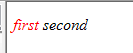
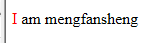
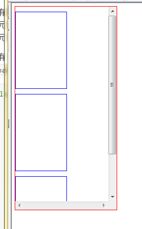
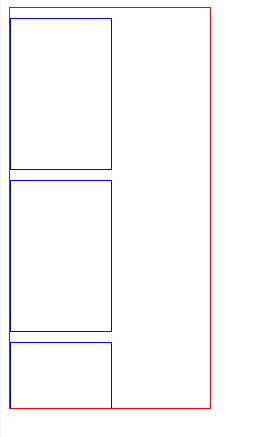
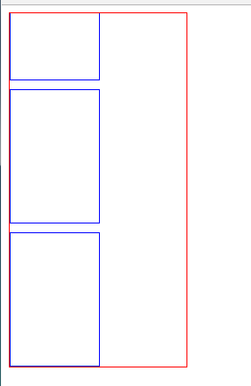

### 伪类和伪元素

以下内容摘自[这里](http://www.alloyteam.com/2016/05/summary-of-pseudo-classes-and-pseudo-elements/)

先说说为什么要引入伪元素和伪类，先看一下[CSS文档](https://www.w3.org/TR/CSS2/selector.html#pseudo-elements)中对伪类和伪元素的介绍：

>In CSS 2.1, style is normally attached to an element based on its position in the [document tree](https://www.w3.org/TR/CSS2/conform.html#doctree). This simple model is sufficient for many cases, but some common publishing scenarios may not be possible due to the structure of the [document tree](https://www.w3.org/TR/CSS2/conform.html#doctree). For instance, in HTML 4 (see [[HTML4\]](https://www.w3.org/TR/CSS2/refs.html#ref-HTML4)), no element refers to the first line of a paragraph, and therefore no simple CSS selector may refer to it.
>
>CSS introduces the concepts of [pseudo-elements](undefined) and [pseudo-classes](undefined) to permit formatting based on information that lies outside the document tree.

翻译过来就是：当前的样式能满足大多数的情况，但也只是大多数，比如，没有专门的元素来表示某一个段落的第一行，所以也就没有对应的选择器来指向段落第一行。为了能格式化处于DOM树之外的元素的样式，CSS引入了伪类（pseudo-classes）和伪元素（pseudo-elements）。

伪类修饰的应该是在文档树上存在的元素，但是无法使用html语言通过标签名、属性、内容定位到（除了`:first-child`，`:lang()`）的元素，伪类提供了一种通过某种特征来指定这些元素的一种机制，从而使得css样式可以应用到这些元素上。这种特征是无法通过html语言推断出来的；伪元素则是通过对**文档树以外**的元素进行抽象使得css样式可以应用到这些元素上


__伪类__：伪类用于向某些选择器添加特殊的效果。

__伪元素__：伪元素用于将特殊的效果添加到某些选择器。

### 伪类和伪元素的区别

以伪类`:first-child`和伪元素`::first-letter`来进行比较。

```html
<style>
	p>i:first-child {color:red}
</style>
<p>
	<i>first</i>
	<i>second</i>
</p>
```

伪类`:first-child`添加到样式到第一个子元素。

这里如果不使用伪类，但要达到同样的效果，可以这样做：

```html
<style>
	.first-child {color:red}
</style>
<p>
	<i class="first-child">first</i>
	<i>second</i>
</p>
```

即给第一个子元素添加一个类，然后定义这个类的样式。接着看伪元素：

```html
<style>
	p:first-letter{
      	color:red
	}
</style>
<p>I am mengfansheng</p>
```

伪元素`:first-letter`添加样式到第一个字母。

这里如果不使用伪元素，而想达到同样的效果，需要这样做：

```html
<style>
	.first-letter{
      	color:red
	}
</style>
<p><span class="first-letter">I</span> am mengfansheng</p>
```

即给第一个字母添加一个`span`，然后给`span`添加样式。

伪类和伪元素的区别已经出来了：

>伪类的效果可以通过添加一个实际的类来达到，而伪元素的效果则通过添加一个实际的元素才能达到，这也是为什么一个叫伪类一个叫伪元素的原因。

最后，伪类和伪元素这么容易混淆是因为两者效果类似，而且写法相仿，但实际上CSS3为了区分两者，已经明确了伪类用一个冒号表示，而伪元素用两个冒号表示。出了一些低于IE8版本的浏览器外，大部分浏览器都支持伪元素的双冒号(::)表示方法。

````css
:Pseudo-classes
::Pseudo-elements
````

### 实际的一个应用

当一个有固定高度的元素，如果其内部的内容高度超过了本身高度，内容就会溢出显示，为了不让内容溢出显示可以设置元素的样式为`overflow:hidden`，但是这样超过的部分就会被遮住，无法看到。为了看到超出的部分，可以设置元素的样式为`overflow:scroll`，这样，元素垂直方向就会出现一个滚动条，提示滚动显示剩下的内容。

```html
<style>
		.box{
			width:200px;
			height: 400px;
			border: 1px solid red;
			overflow:scroll;
		}
		.content{
			width: 100px;
			height:150px;
			margin-top:10px;
			border:1px solid blue;
		}
	</style>
	<div class="box">
		<div class="content"></div>
		<div class="content"></div>
		<div class="content"></div>
	</div>
```

比如上面的代码外层div的右侧会出现滚动条：



但是，有些时候产品会有一些奇葩的要求，比如不要滚动条，那么这个时候，就轮到伪元素`::-webkit-scrollbar`上场了。

为了不让滚动条出现，同时又可以滚动显示超出的内容，需要给外层div加一个伪元素`.box::-webkit-scrollbar:{display:none}`：

```
<style>
		.box{
			width:200px;
			height: 400px;
			border: 1px solid red;
			overflow:scroll;
		}
		.box::-webkit-scrollbar{
          	display:none
		}
		.content{
			width: 100px;
			height:150px;
			margin-top:10px;
			border:1px solid blue;
		}
	</style>
	<div class="box">
		<div class="content"></div>
		<div class="content"></div>
		<div class="content"></div>
	</div>
```


这个时候，效果如下：



滚动条消失了，但是依然可以滚动。奇淫巧技，奇淫无比！

补充一下关于滚动条的伪元素：

>- ::-webkit-scrollbar 滚动条整体部分
>- ::-webkit-scrollbar-thumb  滚动条里面的小方块，能向上向下移动（或往左往右移动，取决于是垂直滚动条还是水平滚动条）
>- ::-webkit-scrollbar-track  滚动条的轨道（里面装有Thumb）
>- ::-webkit-scrollbar-button 滚动条的轨道的两端按钮，允许通过点击微调小方块的位置。
>- ::-webkit-scrollbar-track-piece 内层轨道，滚动条中间部分（除去）
>- ::-webkit-scrollbar-corner 边角，即两个滚动条的交汇处
>- ::-webkit-resizer 两个滚动条的交汇处上用于通过拖动调整元素大小的小控件


### 从网上盗来的关于伪类和伪元素的总结图


